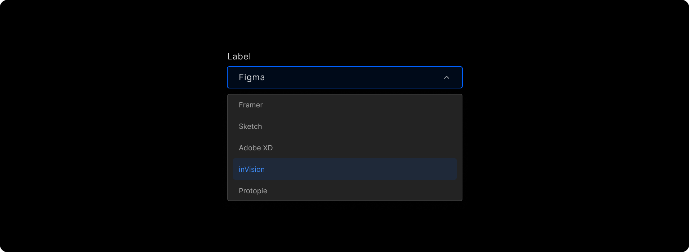
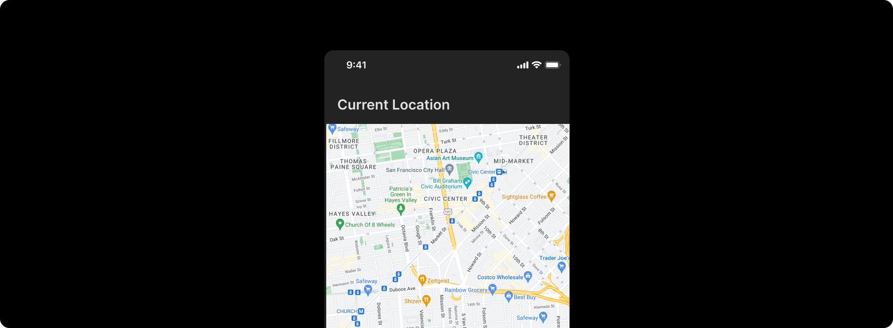

# Change View Components

DhiWise auto-identifies all your screen view components and generates a complete code for the same. Generally, it auto-detects the components, but sometimes due to design changes, it may not able to identify them. 

To get the missing component identified, you can **change the view** of the misidentified component to the correct one in DhiWise.

:::info
To get identify your components directly from **Figma**, you can also refer below;

1. Refer to the <a href="/docs/Designguidelines/intro">design guidelines</a> or <a href="/docs/Designguidelines/component-specific-guidelines/">component-specific guidelines</a> which should be followed while screen designing in Figma. 

2. <a href="/docs/Designguidelines/tagging-components-in-figma">Tag a specific component</a> in Figma and get it auto-identified in DhiWise. 
:::

Components like **Calendar**,**Map** and other complex components cannot be identified easily, so DhiWise offers functionality to change the view of that component and get your design identified easily. Below are such supported views:

:::tip
To know more about how to change the view of a component:
For Flutter <a href="/docs/flutter/change-widget">learn here</a>, and for React <a href="/docs/react/change-view">learn here</a>.
:::

## AutoCompleteTextfield

AutoCompleteTextfield are similar to <a href="/docs/Designguidelines/component-specific-guidelines/input-controls#textfield">TextField</a>, just they have additional functionality of auto-fill. 

In auto-identification, AutoCompleteTextfield will be identified as TextField, but to make it work like AutoCompleteTextfield you would have to change the view and make the TextField as AutoCompleteTextfield.

  

## Calendar

A calendar is a complex component, which cannot be identified easily, so to identify the calendar simply change its view to Calendar.

  

## Fragment

A Fragment might be used to present a sliding drawer, tabbed content, or as a page in a **Pager**, or it might simply represent a normal screen. To get a component identified as Fragment, change its view to Fragment.

Hello world;

## GoogleMap

GoogleMap is not identified in DhiWise auto-identification, so to identify it in design, change the view of it to GoogleMap.

  

## WebView

WebView is not identified in auto-identification, so to get it identified you would have to change the view to WebView.

  