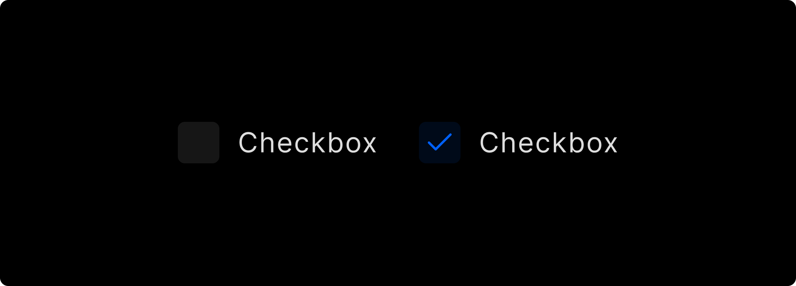
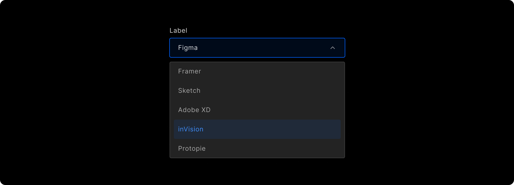
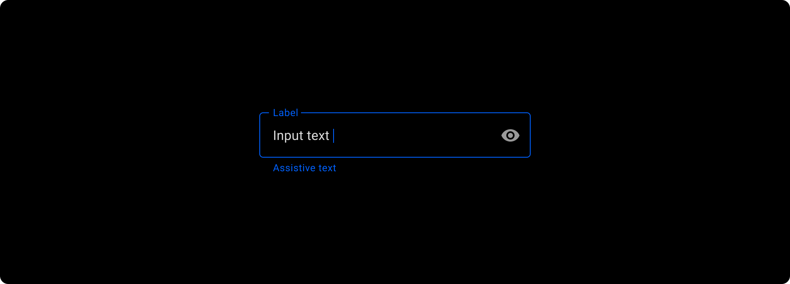
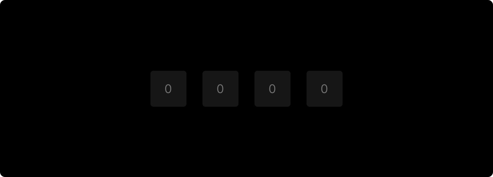

# Input Controls

Input controls are used in the app’s user interface to take user **inputs**, which makes it interactive to use and are commonly used in screen design. Refer to specific component guidelines while designing it in Figma, to get them correctly identified in DhiWise.

## **Checkbox**

Box shape for checkbox must be designed using <a href= "https://help.figma.com/hc/en-us/articles/360040450133#rectangle">Rectangle</a> only.

Checkbox’s **box** and its **Text** should be in a proper group as below;

## **DropDown**
Dropdown group should have an **arrow** facing bottom direction on its **right side** only, and an attached **text** which is given to identify what type of drop down it is.

## **FloatingTextField**

### Outline case

FloatingTextField designed with an **outline** must have the **main text** included within the outline and the **hint text** for it must be inside the outline, as shown below;

### Fill case

The FloatingTextField which is with a **filled case**, must have a filled rectangle with the two texts and the filled rectangle should only have the top two corners **rounded**, and normal bottom corners with an **outline**.

## **OTPView**

OTPView should have at least **four** and a maximum of **six** views which are used to enter the value for the OTP code.

These views must be **aligned** with each other and placed in the **center** of the screen design.

## **Radio**
Circular shape for radio must be designed using <a href="https://help.figma.com/hc/en-us/articles/360040450133#ellipse">Ellipse</a> only.

If there are multiple Ellipses, place them all in one group for a better design hierarchy.

Radio’s **Ellipse** and **Text** should be in a proper group as below;

## **SearchView**
For Search view, it should must have a group with a search icon, and a related text inside it.

## **Switch**   
### Inside thumb case

Switch with thumb design **inside** of the background rectangle should lie in the inner area of the rectangle completely.

### Outside thumb case

Switch with thumb design going **outside** of the background rectangle should be big in size than the outer background rectangle but must lie on the background rectangle.

:::danger
Switch with **text** in its background rectangle is not supported.
:::

The color of the Switch and its background rectangle should not be the **same**.

## **TextArea**

TextArea is used to get a text input with **multi-line**.  

For TextArea use <a href="https://help.figma.com/hc/en-us/articles/360040450133#rectangle">Rectangle</a> and Text inside it as a hint text to get it easily identified in DhiWise.

## **TextField**

Generally, TextField has a Text on top which says which type of field it is and a field to enter an input below with a hint text for reference.

The **Rectangle** and the **Text** above it must be placed in a proper hierarchy, with text on top followed by the rectangle with its **hint text**.

Also, manage proper layering while designing **TextField**, to get it identified in your application.

 
 

Got a question? [**Ask here**](https://discord.com/invite/rFMnCG5MZ7).