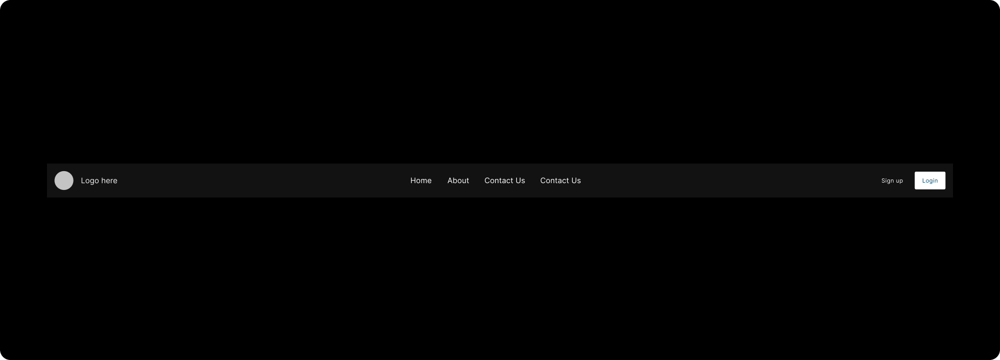

# Navigation Controls

Navigation controls are implemented to help user to interact within the app, which allows the user to navigate across, in, and out of the different areas in the app. Refer to specific component guidelines while designing it in Figma, to get them correctly identified in DhiWise.

## AppBar
AppBar should always be in the **top space** of the screen design.

:::caution
It should cover screen’s full-width.
:::

All the inner child must be grouped into one.

Many various types of Appbar are supported.

## Bottom bar

:::note
BottomBar should always be designed at the **bottom** of the screen
:::

All the BottomBar inner components must be kept inside and with proper grouping.
## Button

Button helps to communicate throughout the application. They are used to navigate across, trigger an event, etc. in the app.

:::caution
Button’s text should be aligned to **center** only.
:::

Text assigned to Button is suggested to keep exactly in the center of the Button.

Multiple variants of Button are detected according to their shape and design, like normal rectangle buttons, full-width buttons, buttons with rounded corners, and one which is disabled as shown below;

## FloatingActionButton

FloatingActionButton (FAB) is **circular** shaped button that is floating above the UI and is used to trigger simple events.

Floating action buttons are placed somewhere at the **bottom** of the screen UI, and it must be designed using the below elements;

| Element | Description |
| --- | --- |
| **Ellipse** | To make a circular button, use only ellipse |
| **Image** | An image with center alignment should be placed on the button |
| **Background** | The background color is required for Ellipse|

:::caution
FAB must be placed on the **bottom** part of the screen.
:::

FloatingActionButton which is included in the **BottomBar**, should be grouped inside that particular bottom bar group.

## Footer
Footer is an area located at the exact **bottom** of every page, below the main body content.

There should be at least three Text inside the Footer content.

If other pages in the app has the same Footer design, then it is recommended to use the **same design** for every page.

## Header
Header is the **top** element of a webpage.

For its design it should be designed in the top area of the page.

Header’s width should be atleast **60%** of the page’s actual total width.

## IconButton

IconButton is one with an icon image on it, sometimes according to their functionality like that in phone call receive and end. 

:::caution
Icon buttons with **circular**, **square**, and **rectangle** with rounded corners shapes are all supported.
:::

IconButton is placed wherever feasible in screen UI, but it must be designed using the below elements;

| Element | Description |
| --- | --- |
| **Ellipse** | To make a circular button, use only ellipse |
| **Image** | An image with center alignment should be placed on the button |
| **Background** | The background color is required for Ellipse|

## Pager

All the elements of the pager should be grouped inside a **single group**.

If the screen UI has a BottomBar below the Pager area then the group for both the Pager and BottomBar should be separate and not grouped into one.

## SideBar
SideBar is used to navigate to different sections of your app easily from one place.

SideBar should be designed using **Rectangle** or **Frame**.

All the elements designed inside the SideBar frame must be in a **column**, one below the other, and following the same alignment.

## TabBar

Tabs organize and allow navigation between groups of content that are related at the same level of hierarchy.

:::caution
Use the default **Line** element provided by Figma to design the Tab selection line.
:::

**Text** and its selection line must be aligned together and should be in the tab group, as below the hierarchy

While designing the Tab, its attached **Pager** must be designed according to its background and alignment.

Various different supported types of Tabs which are identified in DhiWise are,

1. **Same text and line color**

    

2. **Different text and line color** 

     

3. **Same text and line color for all the tabs**

     

4. **Rectangle tabs with a selection of color**

     

4. **Rectangle tabs with selection color with simple tabs**

     

 
 

Got a question? [**Ask here**](https://discord.com/invite/rFMnCG5MZ7).