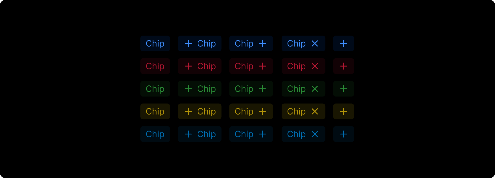
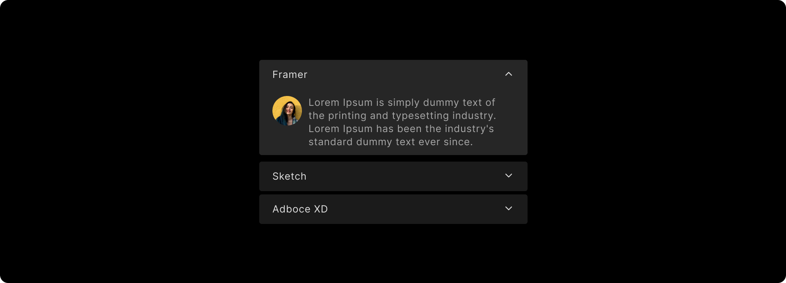
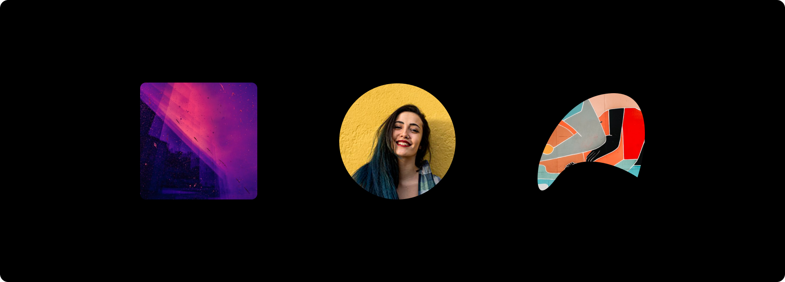
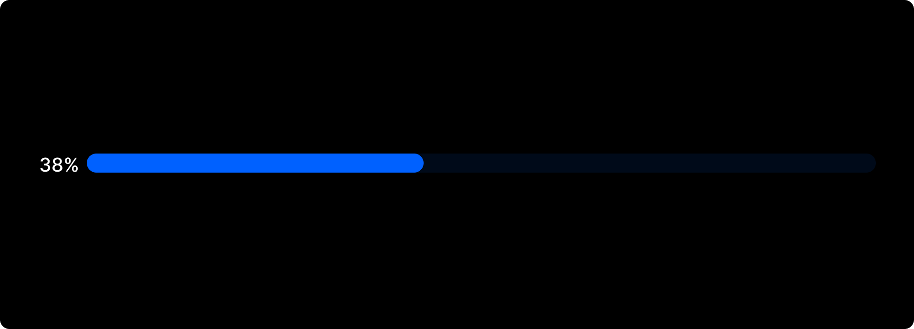
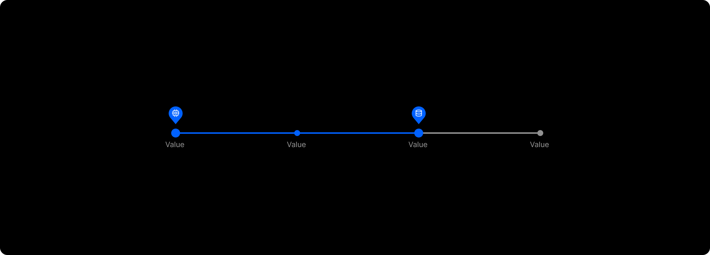
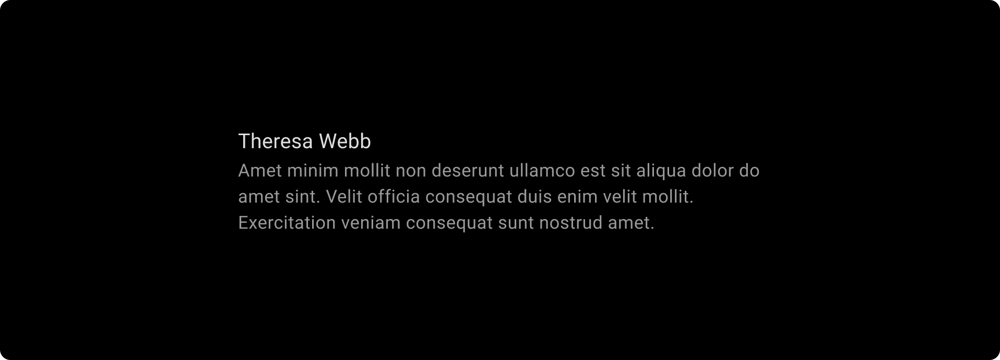

# Output Controls

Output controls are used to display the results related to the data on the screen. They give information like progress, display lists, images, etc. Refer to specific component guidelines while designing it in Figma, to get them correctly identified in DhiWise.

## **ChipView**

All the chip elements must be inside one group, and each group must have a **text** with/without an icon on its left or right.

Every chip element should have the same alignment **vertically**, and the text width must be based on the text wrap according to the text size so every chip differs from the other.
## **CircleImageView**

To design a CircleImageView use <a href="https://help.figma.com/hc/en-us/articles/360040450213-Vector-networks">Vector</a>, <a href="https://help.figma.com/hc/en-us/articles/360040450133#rectangle">Rectangle</a> , or <a href="https://help.figma.com/hc/en-us/articles/360040450133#ellipse">Ellipse</a>. 

Only **Vector** should be used while designing icons in screen UI and a proper image masking if needed to apply.

## **Expandable list**

List items should be placed in proper group which is a common cell in the list.

For expandable list, the design must include an icon which is in **collapsed** or **expand** mode.

Expand item must be placed in any part of the screen UI but not at the extreme **bottom** of the screen.

All the collapsed items should have the same design, as shown below;

## **Grid**

All the components for the **Grid** should be commonly designed and used on the screen.

Keep the same design for all the **Grid** cells.

## **ImageView**

To design an image view use <a href="https://help.figma.com/hc/en-us/articles/360040450213-Vector-networks">Vector</a>, <a href="https://help.figma.com/hc/en-us/articles/360040450133#rectangle">Rectangle</a> , or <a href="https://help.figma.com/hc/en-us/articles/360040450133#ellipse">Ellipse</a>. 

Only <a href="https://help.figma.com/hc/en-us/articles/360040450213-Vector-networks">Vector</a> should be used while designing icons for screen UI.

The **vector elements** or **path** of the Image must be in a single group, so its vector path is easily identifiable in the design hierarchy.

## **List**

All the components for the **List** should be commonly designed and used on the screen.

Keep the same design for all the **List** cells.

## **ProgressBar**

### Normal progress
Use <a href="https://help.figma.com/hc/en-us/articles/360040450133#rectangle">Rectangle</a> to design normal progress, one to highlight the progress and the other without progress, as shown below;

### Circular progress
Use only <a href="https://help.figma.com/hc/en-us/articles/360040450133#ellipse">Ellipse</a> while designing circular progress, with the help of Arc tool in Figma. 

## **RangeSeekBar**

RangeSeekBar is a custom <a href="/docs/Designguidelines/component-specific-guidelines/output-controls#seekbar">SeekBar</a> with two thumbs in it to set a specific range of progress.

:::info
Follow <a href="/docs/Designguidelines/component-specific-guidelines/output-controls#seekbar">SeekBar</a> guidelines priorly to design RangeSeekBar.
:::

For its design, add two thumbs in the design to get it identified.

## **SeekBar**

SeekBar seems almost same as the <a href="/docs/Designguidelines/component-specific-guidelines/output-controls#progressbar">ProgressBar</a> just it has a thumb on it, which is used to change the progress value. The user can touch the thumb and drag left or right to set the current progress level.

While designing SeekBar, it should have a **thumb** and a **Rectangle** sliding bar.

## **Staggered Grid**

There should be atleast one or more items in the staggered with different **height**, else it will not be considered as a staggered.

Keep the same design for all the staggered cells.

## **TextView**

Keep Text width as **auto-width** while designing it in the Figma file. So it will remain **flexible** in design to set.

 
 

Got a question? [**Ask here**](https://discord.com/invite/rFMnCG5MZ7).