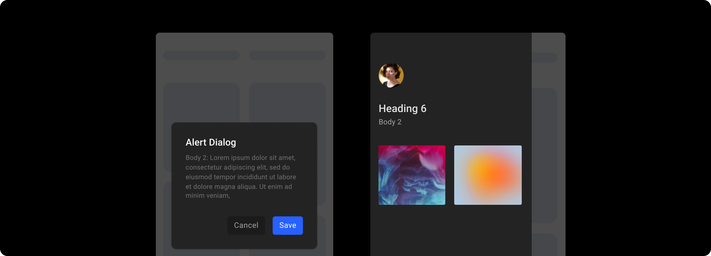
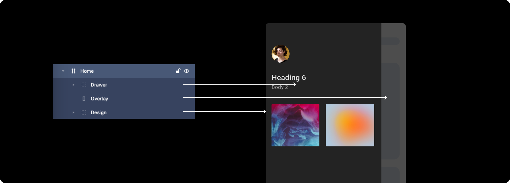
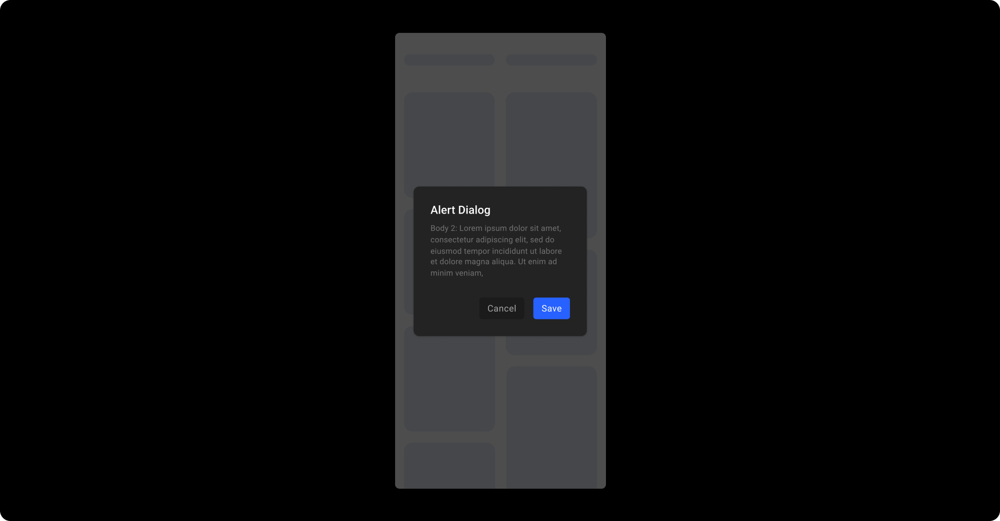
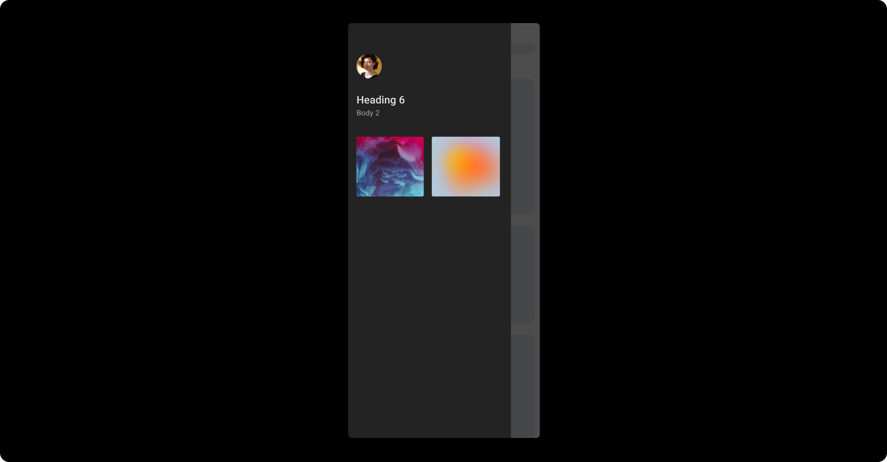
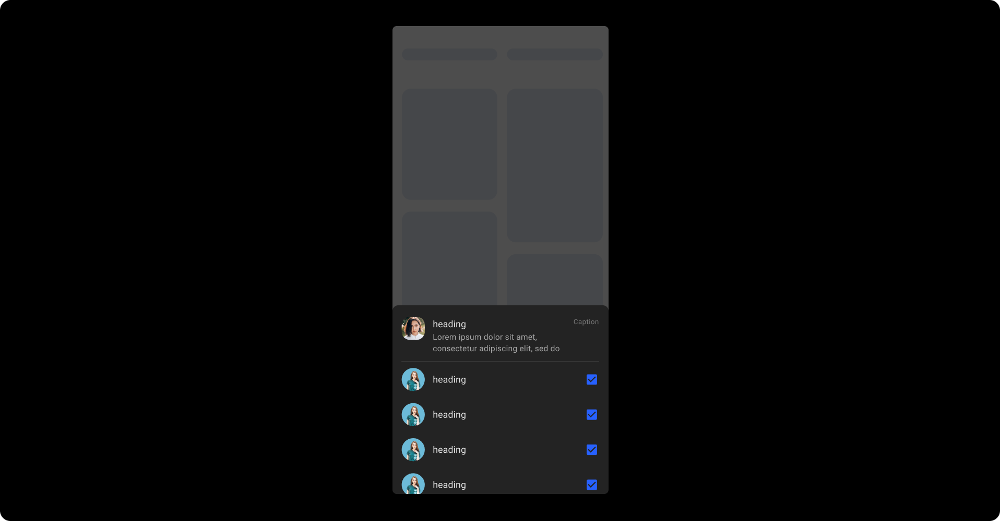

# Overlay Controls

## Dialog/ Drawer/ Bottomsheet

To get your Dialog or Drawer or Bottomsheet design identified by DhiWise, you must implement the below design practices while designing it.

#### Steps to follow :
Firstly, while starting it you will necessarily need three components:

Commonly faced issues for dialog/ drawer/ bottomsheet being not identified from the design are, that the overlay does not cover the screen completely or the edges of a dialog go beyond the screen bounds.

To avoid such layering practices, follow the below guides:

1. The applied overlay should cover the screen completely, else dialog box/ drawer/ bottomsheet would not be detected,

2. The design for dialog should be in the exact **center** of the overlay, for the bottom sheet it must start from the **bottom**, and for the drawer, it must be on the **left** of the overlay,

3. The hierarchy of screen layers should go like this from the top, first should be your dialog box/ drawer/ bottomsheet, followed by the overlay, and lastly everything else below the overlay.

Refer to below to get an idea about how to create a perfect design for your dialog.

Similarly, get an idea about how to perfectly design your drawer design.

Similarly, get an idea about how to perfectly design your bottom sheet design.

 
 

Got a question? [**Ask here**](https://discord.com/invite/rFMnCG5MZ7).