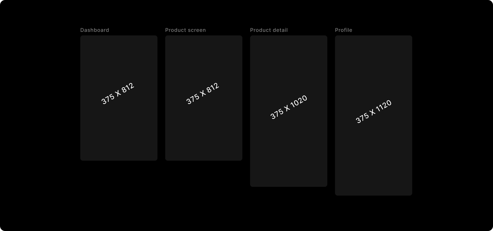

# Design using Frames

:::tip
DhiWise supports Figma screens designed only on a <a href="https://help.figma.com/hc/en-us/articles/360041539473-Frames-in-Figma" target="_blank">Frame</a>.
:::

 

Frame is one of the flexible shapes supported by Figma. Figma refers to frame as the **root component** for a screen, as it allows you to create a container of your desired **viewport size** for any device provided in <a href="https://help.figma.com/hc/en-us/articles/360041539473-Frames-in-Figma" target="_blank">Frame</a> presets. This also helps in complex design as it supports additional functionalities like <a href="https://help.figma.com/hc/en-us/articles/360040451373" target="_blank">Auto Layout</a>, <a href="https://help.figma.com/hc/en-us/articles/360039957734" taget="_blank">Constraints</a>, <a href="https://help.figma.com/hc/en-us/articles/360040450513" target="_blank">Layout grids</a>, and <a href="https://help.figma.com/hc/en-us/articles/360040314193" taget="_blank">Prototyping</a>.

## **Guidelines while designing a screen**
Create a screen on Figma canvas with the **Frame tool** or choose your relevant viewport from the <a href="https://help.figma.com/hc/en-us/articles/360041539473-Frames-in-Figma#Change_the_frame_preset" target="_blank">Frame presets</a> from <a href="https://help.figma.com/hc/en-us/articles/360041539473-Frames-in-Figma#Properties_Panel">Properties Panel</a>, as shown below

### Height and Width
Keep the same height and width for all screens, except the one which includes <a href="https://help.figma.com/hc/en-us/articles/360039818734-Prototype-scrolling-with-overflow-behavior">overflow behaviours</a> like a vertical scroll.

:::caution
 

**Screen size for Mobile devices**: Frame height must be more than **200px**, and the width must be between **200px** and **800px**.
 

**Screen size for Web**: Frame height must be more than **200px**, and the width must be between **800px** and **992px**.
:::

 

Below, both the Login and Register screens are not scrollable, so they have the same height and width. While Dashboard is a vertically scrollable screen, thus its height is different and it also includes a horizontal scroll for the categories.

:::note
Add required scrolling for the vertical and horizontal scroll and even for the inner horizontal scrolls.
:::

 
 

Got a question? [**Ask here**](https://discord.com/invite/rFMnCG5MZ7).