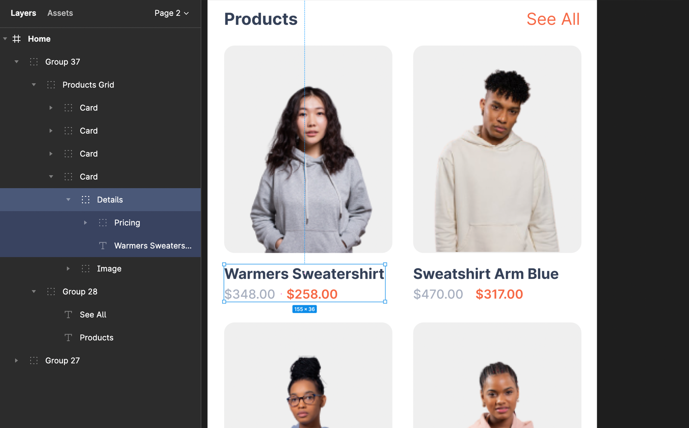
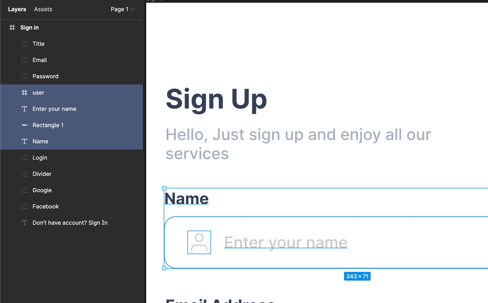
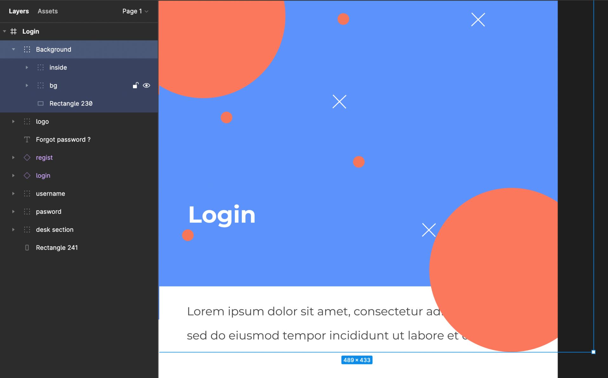

# Group Components and Layers

Group your design properly into one and get better results!

 

Everything is a group of layers in a screen design, which needs to be managed properly in a good hierarchy.

<a href="https://www.figma.com/best-practices/groups-versus-frames/" target="_blank">Groups</a> handle your design easily with fewer layers when having similar design components. It auto-adjusts itself when its child objects are being resized.

 
 

:::tip
Keep your layers sorted. Group and arrange them well in your design. 
:::

Components and objects designed by you like background images or buttons must be kept in a single group with proper hierarchy order, so it creates concise layering all over the design and easy to handle objects within one single element.

:::info
Avoid ungrouped designing, grouping helps you identify your components easily.
:::

For example, an E-commerce app has shopping lists, in that list, you will find the image of the product, its main text, description, and price. These single components are first properly layered with a background image and then all the components are layered into one another to form a proper group.

 
 

Got a question? [**Ask here**](https://discord.com/invite/rFMnCG5MZ7).