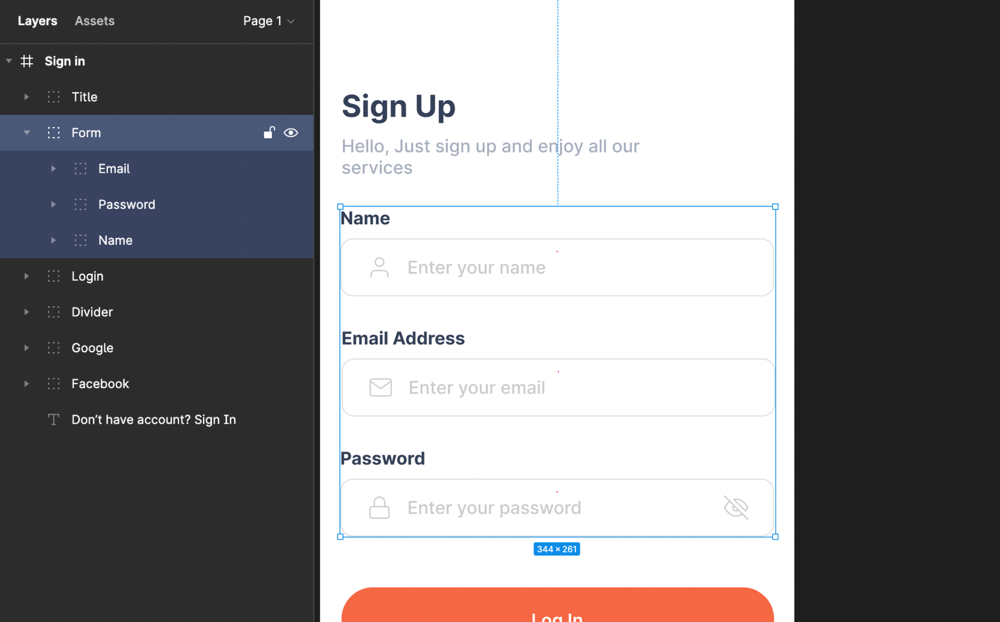

# Name Everything

Don’t leave your design without giving them an identity!

Naming each layer is hard, which means that a lot of the time we neglect it until the last minute and end up with a messy design hierarchy, where we cannot identify them when in need.

:::info
All your screens **folder**, **file**, and **components** name in DhiWise will be generated on the basis of the name assigned to **screens** and its **components** in Figma.
:::

## Naming Screen and Component 

Give specific names to application screens and all the components included in them.

For example, if it is a Login screen, give it a name as Login Screen. Similarly, if it includes the functionality of payment, then name it Payment Screen.

Similarly, name the components of the **Login screen** as per their functionalities and appearance, as below;

 
 

Got a question? [**Ask here**](https://discord.com/invite/rFMnCG5MZ7).
