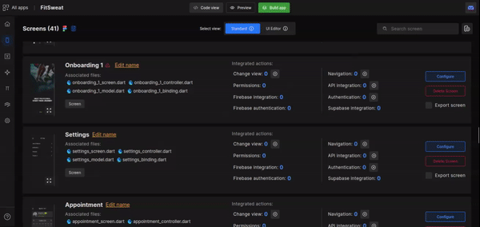

# Components Outside Frame

Do not let your screen design components clutter out in the canvas. Keep them all inside the screen’s frame.

In the below GIF the component is outside of the screen, which is the wrong design. Try to avoid such scenarios while doing design to code in DhiWise.

<!--  -->

For the components like **Horizontal list**, and **Horizontal scroll** its scrolling components can be kept outside the screen frame, rest all components should be kept inside a screen’s frame.

<!--  -->

 
 

Got a question? [**Ask here**](https://discord.com/invite/rFMnCG5MZ7).