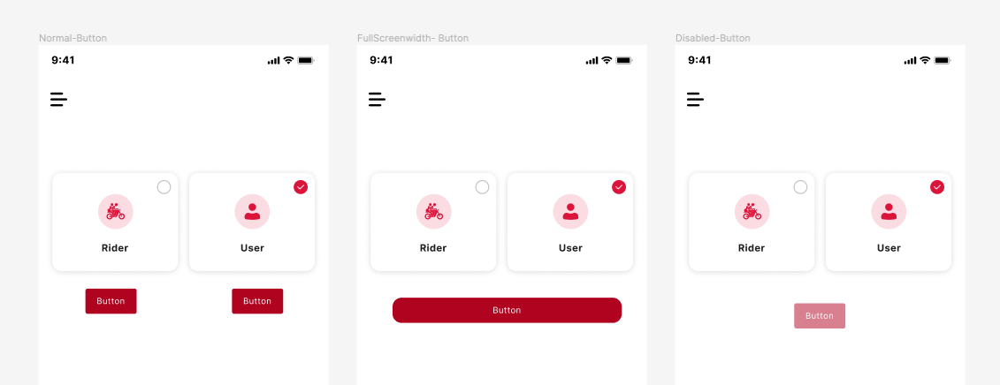

# Invisible Components

Only play with what is visible!

While designing some elements are **hidden** behind the ones which are visible, to make them invisible. But the design which is imported into the DhiWise should avoid such elements.

In the below screen, many elements are hidden components, which should be avoided;

<!--  -->

Also, the practice of hiding the element by the use of fill property or the same background color, like in the below image the square box is hidden by the same color should also be avoided.

<!--  -->

It is preferred to make those components visible or just remove them from your design, as design with such practices is not relevant and it will affect your design accuracy in DhiWise.

 
 

Got a question? [**Ask here**](https://discord.com/invite/rFMnCG5MZ7).