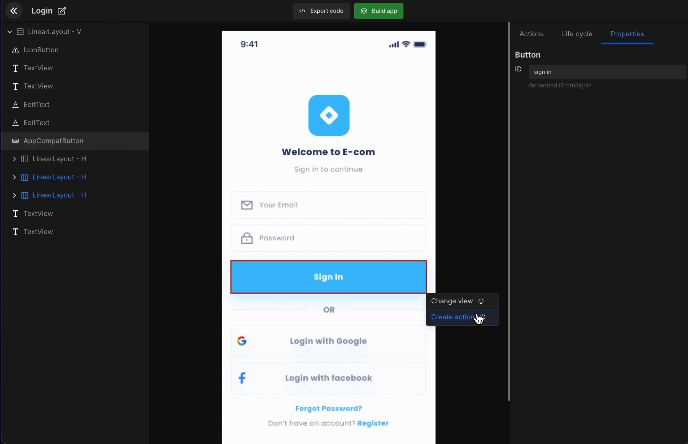
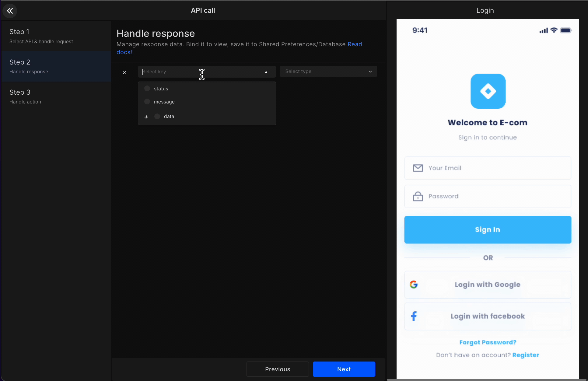
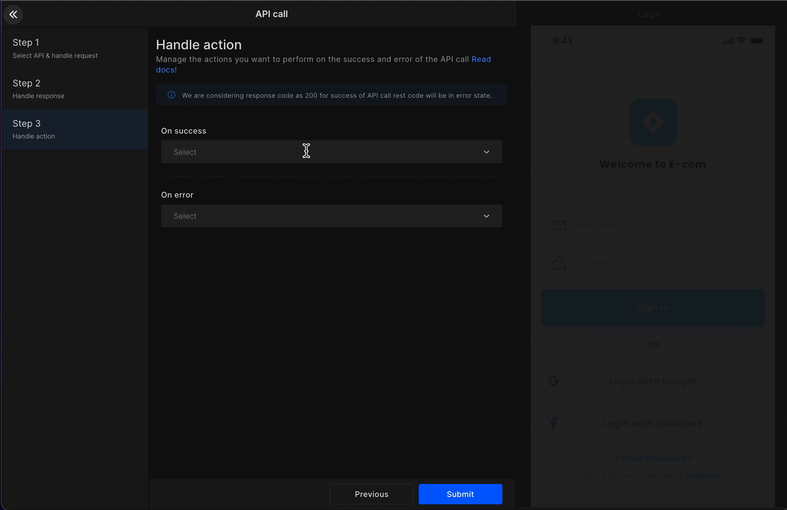

import navigationImg from "./img/navigation.png"
import PermissionImg from "./img/Permission.png"
import AlertImg from "./img/Alert.png"

# API Integration

Integrate API in any component or screen by selecting API from create action or onCreate. However, the APIs are required for the API integration to work, which can be uploaded or added manually.


#### **Step 1:**

Search the API you want to access. Then select the required **header**, **parameter**, and **body**. 

:::info
In Body, select the view from which you want to assign data to an API request. You will get the code with API request variables assigned to this view's value.
:::



#### **Step 2:**

Manage response data and bind it to the respective view. Select the required **key** and **view**.

:::info
Save the data to preference to showcase it at other places in your application with the lifecycle feature in screens for Android and Flutter app builders.
:::




#### **Step 3:**

Manage the action you want to perform on the success or error of your API call. In dropbox, it will show you the options which we have already covered like <a href="docs/android/navigation">Navigation</a>, <a href="/docs/android/show-alert">Show Alert</a>, <a href="/docs/android/add-permissions">Permissions</a>, and such.

<div className="grid grid-cols-3 gap-20">
      <a className="Card" href="docs/android/navigation">
        
        <h4>Navigation</h4>
      </a>
      <a className="Card" href="/docs/android/show-alert">
        
        <h4>Show Alert</h4>
      </a>
      <a className="Card" href="/docs/android/add-permissions">
        
        <h4>Permissions</h4>
      </a>
    </div>

<br/>



#### Generated code snippet

```js title="apiIntegration.kt"
//service class
  @POST("/device/auth/login")
  public suspend fun createLogin(@Header("Content-Type") contentType: String?, @Body
      createLoginRequest: CreateLoginRequest?): CreateLoginResponse

//Repository class
 public suspend fun createLogin(contentType: String?, createLoginRequest: CreateLoginRequest?):
      Response<CreateLoginResponse> = try {
    val isOnline = MyApp.getInstance().isOnline()
    if(isOnline) {
      SuccessResponse(retrofitServices.createLogin(contentType, createLoginRequest))
    } else {
      val internetException =
          NoInternetConnection(MyApp.getInstance().getString(R.string.no_internet_connection))
      ErrorResponse(internetException.message ?:errorMessage, internetException)
    }
  } catch(e:Exception) {
    e.printStackTrace()
    ErrorResponse(e.message ?:errorMessage, e)
  }

  //ViewModel class
   public val createLoginLiveData: MutableLiveData<Response<CreateLoginResponse>> =
      MutableLiveData<Response<CreateLoginResponse>>()

  public fun onClickBtnSignIn(): Unit {
    viewModelScope.launch {
      progressLiveData.postValue(true)
      createLoginLiveData.postValue(
      networkRepository.createLogin(
      contentType = """application/json""",
          createLoginRequest = CreateLoginRequest(
          password = loginModel.value?.etPasswordValue,
          username = loginModel.value?.etYourEmailValue)
      )
      )
      progressLiveData.postValue(false)
    }
  }

  public fun bindCreateLoginResponse(response: CreateLoginResponse): Unit {
    val loginModelValue = loginModel.value ?:LoginModel()
    loginModel.value = loginModelValue
  }

  //Api call on Button click from controller class
  this@LoginActivity.hideKeyboard()
  viewModel.onClickBtnSignIn()

  //observer in controller class
  viewModel.createLoginLiveData.observe(this@LoginActivity) {
    if(it is SuccessResponse) {
    val response = it.getContentIfNotHandled()
    onSuccessCreateLogin(it)
    } else if(it is ErrorResponse)  {
    onErrorCreateLogin(it.data ?:Exception())
    }
  }

  //Success Response in controller class
  private fun onSuccessCreateLogin(response: SuccessResponse<CreateLoginResponse>): Unit {
    viewModel.bindCreateLoginResponse(response.data)
  } 

 //Error Response in controller class
  private fun onErrorCreateLogin(exception: Exception): Unit {
    when(exception) {
      is NoInternetConnection -> {
        Snackbar.make(binding.root, exception.message?:"", Snackbar.LENGTH_LONG).show()
      }
      is HttpException -> {
        val errorBody = exception.response()?.errorBody()?.string()
        val errorObject = if (errorBody != null  && errorBody.isJSONObject()) JSONObject(errorBody)
            else JSONObject()
        val errMessage = MyApp.getInstance().getString(R.string.lbl_error)
        this.alert(MyApp.getInstance().getString(R.string.lbl_alert),errMessage) {
          neutralButton {
          }
        }
      }
    }
  }
```


<br/>
<br/>

Got a question? [**Ask here**](https://discord.com/invite/rFMnCG5MZ7).