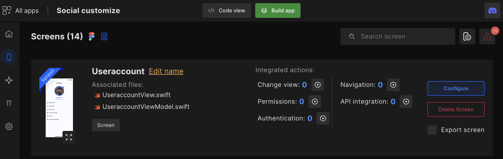
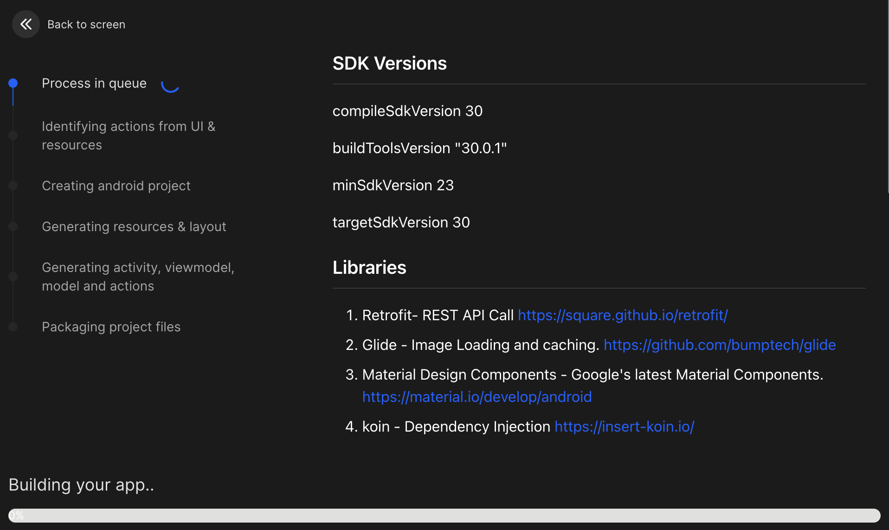
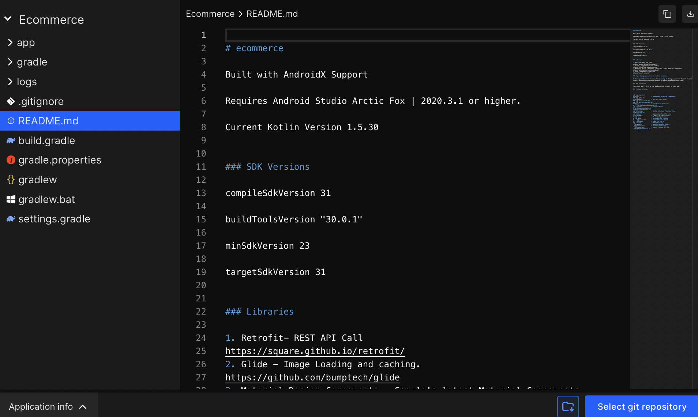

# Build or Review code

## Build App

With DhiWise you can build an app for Kotlin anytime. You can build an app right after fetching designs from Figma. If your Figma design has prototyping then it will be auto-implemented on your APK file when you build the app without making any change.

Click on the `Build app` button to generate code for the first time in any application.

It will show another popup with the button "**Build app**" on it, click on that button.

It will redirect you to a page where the DhiWise Kotlin builder starts generating the code. You can see the **progress** of code generation along with the **process** that's been happening.

#### Once the code gets generated

You will be redirected to the code screen and from there you can download the **source code** and **APK**.

You will receive an email with the **Download APK** option, it will be debugged APK and can be installed directly on your android phone.

- You can still make changes to the application using Kotlin app builder features starting from screen actions & navigation management, adding product flavors, integrating APIs, adding constants, and managing the local database.

- You can directly apply features to your application with just a click from the configuration. Then again you can re-build the app at any time.

The next time you build the app you can also see the details of the previously built apps i.e. **date & time**, and **total files**.

Click on `Build app` to generate the updated code.

You will be redirected to the code generation page. You can see the **progress** of code generation along with the process that's been happening.

Also, you will be able to **count the files** which were generated in the previous build.

That's it, this is how you can build the app and redirect it to the code screen.

## Review Code

Building a quality product is not easy, developers need to keep a checklist for managing code and the logic in the best possible way. It's expected to produce clean and scalable code to sustain a product/application in the market. DhiWise Android app builder helps you achieve the same.

<h3>To review the code,</h3>

- First, you need to build the app.

- Once you finish building the app, you can visit the "Code" screen and review the code generated using the Android app builder.

- You can view the code and "Download source code" when needed, or sync your code with GitHub and GitLab. You can also view your application info.

- In the left panel, you can see the folder structure. The folder structure of the application will be created automatically depending on the design, actions performed and configurations selected by you.

We recommend you to check the **README.md** file, this file consists of the following information:

- App details

- SDK Versions

- Libraries

- Package structure

- Missing fonts on the design files

- Drawables

This file will help you understand details about the app and code.

 
 

Got a question? [**Ask here**](https://discord.com/invite/rFMnCG5MZ7).