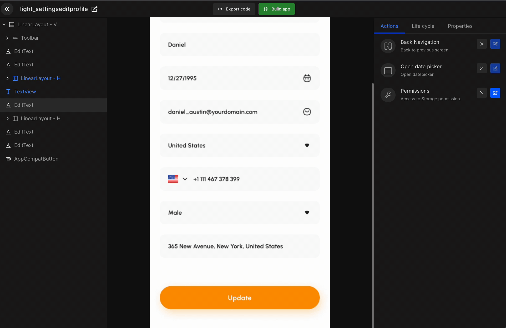
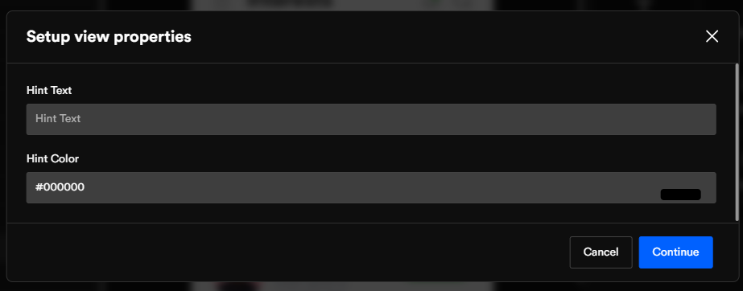

# Change View

After the Figma is fetched in Screens, the algorithm identifies the design into view components. However, not all view components have been correctly identified. Therefore, the change view options help you change the component type to its suitable component.

:::tip Example
A button might be identified as an image; therefore, it can easily be changed to the button component.
:::

## How does it work

The option `Change view` is to change the existing UI view component to any other if required.

:::tip Example
A TextView can be changed to EditText if requires as DhiWise accuracy depends on the app design. 
:::

:::info
Check out our <a href="/docs/Designguidelines/intro">Figma design articles</a> to learn the best design practices to utilize DhiWise to its full potential 
:::

<h3>View components:</h3>

**Fragment | TextView | AppCompatButton | EditText | TextInputEditText CircleImage RadioButton | AppCompatCheckBox | FloatingActionButtonFrameLayout | MaterialCardView LinearLayout - H | LinearLayout - V RadioGroup | RecyclerView RecyclerView - GridLayout | TabLayout ViewPager2 | Toolbar | BottomBar | ImageView google maps | calender | Dropdown | DrawerItem | AutoCompleteTextField**

## Configure view components in detail view

Follow the below steps to change view components.

#### **Step 1:**
Click on the **view component**.

#### **Step 2:**
Select `Change view`.

#### **Step 3:**
Select the required **component** from the list.

Depending on the view you have selected, a popup will appear to add **view properties**.

:::tip Example
We have selected "Edit text", add properties value in the popup. Click on "Continue" to finish adding the view properties.
:::

If the component you are converting to is used on multiple screens, then they all will be identified in a list, and you will have the option to implement the changes to all of them.

You can either "**Select all**" components to convert or you can select specific. Once done, click on the "**Convert to EditText**" button to successfully change the view type.

Similar to this, you can select any other view type and follow the steps to convert it to your desired view type. 

 
 

Got a question? [**Ask here**](https://discord.com/invite/rFMnCG5MZ7).