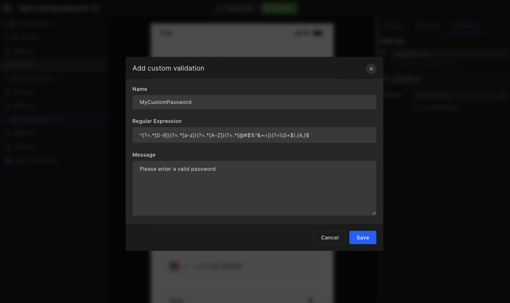

# Configure Screens

## Introduction to Screens

Screens is a core feature of the Android app builder. In Screens, developers can customize UI view components, map out screen actions, & set up lifecycle methods and get a complete UI design code.

Files fetched from Figma are displayed on **Screens**. 

:::info
In case you are opening this page for the first time, then it may take a few minutes to fetch the design from Figma.
:::

Screens feature is where most of your app development takes place, like API integration, navigations, mapping out actions, and lifecycle.

## Configure screen settings

1. <e className="hightlight">Viewport selection</e>

    Select the viewport size you had in mind when you started creating your app design.

2.  <e className="hightlight">Set splash</e>

    Select an initial screen that appears at the start of your app.

    #### **Step 1:** 
    On the screen list, click on the **Settings** ⚙️ available in the right corner.

    #### **Step 2:** 
    There you will have an option to set your splash screen. Simply click on <code className="primary">Change</code> beside the **Splash screen** option and a dialog box will appear where you need to select a screen from the screens listed and click on <code className="primary">Save & Close</code> to save the selected screen as your app’s splash screen.

    

## Sync Figma Design

To update the (latest) Figma design changes to the (older) design in DhiWise, click on the refresh icon in settings. 

Thereafter, the design in DhiWise is resynced with the design in Figma. However, upon refresh, any integrated actions are lost for the Screens which were updated.

:::tip Example
If originally the screen had a back navigation UI component, but the updated screen design removed the back navigation, then naturally the integrated action is erased.  
:::

## Export code

Developers can download files, export, or copy code for the selected screens. Then integrate those screen codes into their application on their favorite IDE.

This feature gives you the choice to either build the whole application or only work on the screens you want and export the code as quickly as possible.

## Screen Summary

Watch tutorials for actions and check screen types, files, view types, & actions. Moreover, developers can change the screen name, delete screen, as well as configure the screen.

## Change Screens component view type

Bind actions to your UI components like API integrations, navigation, dialog box, permissions, and more.

Change UI view component type, for example, imageview to textview. 

:::info
Once you click on the detailed view, hover on the screen to auto-detect the components and show them in the red highlighted box.
:::

Most of your app development tasks happen in detail view, in which you get three options; **Change view**, **Create action**, and **add validation**. 

## Add Validation

Add validation to field view components like edit text and floating edit text. You can add custom validation or select from our below options:

`Email, password, mobile number, number only, text only, and phone number.`

## Regular Expression

Create your custom validation. Input the regular expression to match the condition you require. 

:::tip Example
In the case of a password, there must be at least one uppercase, one lowercase, one digit, and a special character. We provide regular expressions by default in the generated code for the provided options.
:::

`^(?=.*[0-9])(?=.*[a-z])(?=.*[A-Z])(?=.*[@#$%^&+=])(?=\\S+$).{4,}$`

:::tip Example
Login requires the user to input their username and password as they are mandatory input fields. This option will help you set up mandatory input fields.
:::

## Pagination

Set up the lazy loading feature when you reach the bottom of the list, then set up a message you want when there is no data.

:::tip Example
While scrolling on Instagram when the list ends, you get the lazy loading icon that indicates the new list data is loading.
:::

## Change View

DhiWise algorithm identifies the components in the Figma design file and generates the view component code. <a href="/docs/android/change-view">Learn more</a>
:::tip Example
If your Figma design screen has a radio button view component DhiWise will identify it as a radio button and generated the code respectively. Furthermore, you can make changes to the view component if it's misidentified. 
:::

View types we provide are:

**Fragment | TextView | AppCompatButton | EditText | TextInputEditText CircleImage RadioButton | AppCompatCheckBox | FloatingActionButtonFrameLayout LinearLayout - H | LinearLayout - V RadioGroup | RecyclerView | MaterialCardView RecyclerView - GridLayout | TabLayout ViewPager2 | Toolbar | BottomBar | ImageView google maps | calender | Dropdown | DrawerItem | AutoCompleteTextField | SearchView | WebView** 

## Create Action

Map out your application flow with our interactive UI.  Choose from the 8 actions to create your design view component. <a href="/docs/android/create-actions">Learn more</a>

:::tip Example
Let's say you wish to create an action for your login button then first you need to add or upload your API postman file then choose the view component you wish to integrate API for. It's that simple. Click here to learn more. 
:::

The actions we support are:

**Navigation | show alert permissions | API integration | Firebase integration Authentication | Back navigation | open date picker | open time picker**

## Lifecycle Methods

Choose the required action from the on-create method for all screens. You will get five actions such as Navigate show alert permission API integration, and Firebasae integration. <a href="/docs/android/manage-app-lifecycle">Learn more</a>

 
 

Got a question? [**Ask here**](https://discord.com/invite/rFMnCG5MZ7).