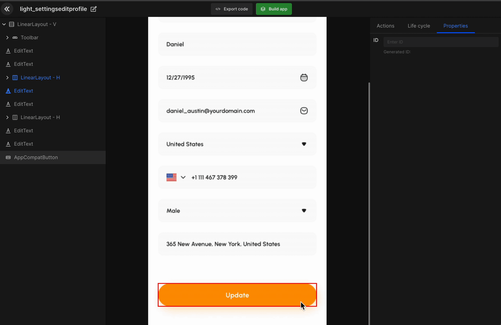

# Create Actions

An app screen has multiple components, many of which perform some action. The "**Create action**" configures which action those components will perform. It can be navigation, API integrations, or any other. 

#### **Step 1:**
Select UI component

#### **Step 2:**
Select Create action

#### **Step 3:**
Select from the list of actions

`API Integration | File Upload | Open data & Time picker | Integrate Firebase | Social Auth | Permissions | Alert box | Navigation | Open Drawer` 

#### **Step 4:**
Select required action for any UI component. 

 
 

Got a question? [**Ask here**](https://discord.com/invite/rFMnCG5MZ7).