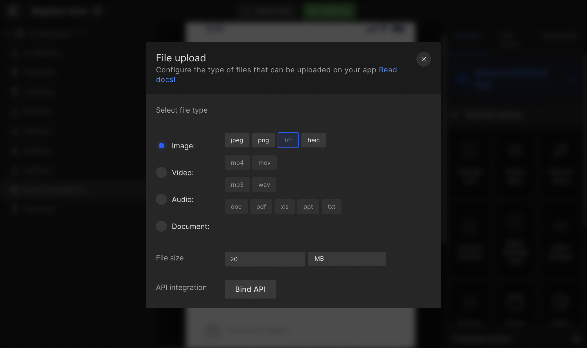

import navigationImg from "./img/navigation.png"
import AlertImg from "./img/Alert.png"
import ApiIntegrationImg from "./img/APIIntegration.png"

# File Upload

Add upload files functionality to any of your UI components. 

:::caution
The upload file API is required before you can bind APIs.
:::

## Select the file and data type




## Bind API

#### Step 1:

Only the upload file API will be available in the list.

<table>
    <tr>
        <td><b>Header</b></td>
        <td>Content-type multipart/form-data</td>
    </tr>
    <tr>
        <td><b>FormData</b></td>
        <td>Selected file or constant</td>
    </tr>
</table>

#### Step 2:

Handle API response

<table>
    <tr>
        <td><b>Key</b></td>
        <td>Give the key a name</td>
    </tr>
    <tr>
        <td><b>Select type</b></td>
        <td>View or save to preference</td>
    </tr>
</table>

:::info

**View**:  Select the view to which you want to show this API key data. You will get the code with API response variables assigned to this view's value.

**Save to preference**: The data will be saved in the API response.
:::

#### Step 3:
Select response for on success or failure. The responses can be from <a href="/docs/android/navigation">Navigation</a>, <a href="/docs/android/show-alert">Show Alert</a>, or <a href="/docs/android/api-integration">API Integration</a>.

<div className="grid grid-cols-3 gap-20">
      <a className="Card" href="/docs/android/navigation">
        
        <h4>Navigation</h4>
      </a>
      <a className="Card" href="/docs/ios/show-alert">
        
        <h4>Show Alert</h4>
      </a>
      <a className="Card" href="/docs/android/api-integration">
        
        <h4>API integration</h4>
      </a>
    </div>
    <br/>

#### Generated code snippet

```js title="fileUplaod.kt"
//service class
  @Multipart
  @POST
  public suspend fun createUpload(
    @Url baseUrl: String,
    @Part part: MultipartBody.Part,
    @Header("Content-type") contentType: String?
  ): CreateUploadResponse

  //repository class
  public suspend fun createUpload(contentType: String?, filePath: Uri):
      Response<CreateUploadResponse> = try {
    val isOnline = MyApp.getInstance().isOnline()
    if(isOnline) {
      val fileName = FileUploadHelper.getFileName(filePath)
      val fileSize = FileUploadHelper.getFileBytes(filePath)
      val fileSizeLimit = 12
      var fileSizeValid = false
      if (fileSize != null) {
        fileSizeValid = FileUploadHelper.convertBytesToMB(fileSize)!! > fileSizeLimit
        if (fileSizeValid) {
          Toast.makeText(MyApp.getInstance(), "File Size is Large", Toast.LENGTH_LONG).show()
        }
      }
      if (fileSize != null && !fileSizeValid) {
        val part = MultipartBody.Part.createFormData("filename",
            fileName,fileSize.toRequestBody("image/*".toMediaType()))
        SuccessResponse(retrofitServices.createUpload("https://v2.convertapi.com/upload",part
        ,contentType))
        } else { 
        ErrorResponse("Something went wrong")
      }
    } else {
      val internetException =
          NoInternetConnection(MyApp.getInstance().getString(R.string.no_internet_connection))
      ErrorResponse(internetException.message ?:errorMessage, internetException)
    }
  } catch(e:Exception) {
    e.printStackTrace()
    ErrorResponse(e.message ?:errorMessage, e)
  }

  //view model
   public val createUploadLiveData: MutableLiveData<Response<CreateUploadResponse>> =
      MutableLiveData<Response<CreateUploadResponse>>()

  public var onClickBtnSignInSelectedFile: Uri? = null

  public fun onClickBtnSignIn(): Unit {
    viewModelScope.launch {
      progressLiveData.postValue(true)
      createUploadLiveData.postValue(onClickBtnSignInSelectedFile?.let {
          networkRepository.createUpload(contentType = """multipart/form-data""",filePath = it) })
      progressLiveData.postValue(false)
    }
  }

  public fun bindCreateUploadResponse(response: CreateUploadResponse): Unit {
    val loginModelValue = loginModel.value ?:LoginModel()
    loginModel.value = loginModelValue
  }

  // controller class
  public fun selectedFileBtnSignIn(path: Uri?): Unit {
    viewModel.onClickBtnSignInSelectedFile = path
    viewModel.onClickBtnSignIn()
  }

  ImagePickerFragmentDialog().show(supportFragmentManager){ path ->
        selectedFileBtnSignIn(path)
  }

  public override fun addObservers(): Unit {
    var progressDialog : AlertDialog? = null
    viewModel.progressLiveData.observe(this@LoginActivity) {
      if(it) {
        progressDialog?.dismiss()
        progressDialog = null
        progressDialog = this@LoginActivity.showProgressDialog()
      } else {
        progressDialog?.dismiss()
      }
    }
    viewModel.createUploadLiveData.observe(this@LoginActivity) {
      if(it is SuccessResponse) {
        val response = it.getContentIfNotHandled()
        onSuccessCreateUpload(it)
      } else if(it is ErrorResponse) {
        onErrorCreateUpload(it.data ?:Exception())
      }
    }
  }

  private fun onSuccessCreateUpload(response: SuccessResponse<CreateUploadResponse>): Unit {
    this.alert(MyApp.getInstance().getString(R.string.lbl_alert),
    MyApp.getInstance().getString(R.string.lbl_success)) {
      neutralButton {
      }
    }
    viewModel.bindCreateUploadResponse(response.data)
  }

  private fun onErrorCreateUpload(exception: Exception): Unit {
    when(exception) {
      is NoInternetConnection -> {
        Snackbar.make(binding.root, exception.message?:"", Snackbar.LENGTH_LONG).show()
      }
      is HttpException -> {
        val errorBody = exception.response()?.errorBody()?.string()
        val errorObject = if (errorBody != null  && errorBody.isJSONObject())
        JSONObject(errorBody) else JSONObject()
        val errMessage = MyApp.getInstance().getString(R.string.lbl_error)
        this.alert(MyApp.getInstance().getString(R.string.lbl_alert),errMessage) {
          neutralButton {
          }
        }
      }
    }
  }
```

<br/>
<br/>

Got a question? [**Ask here**](https://discord.com/invite/rFMnCG5MZ7).