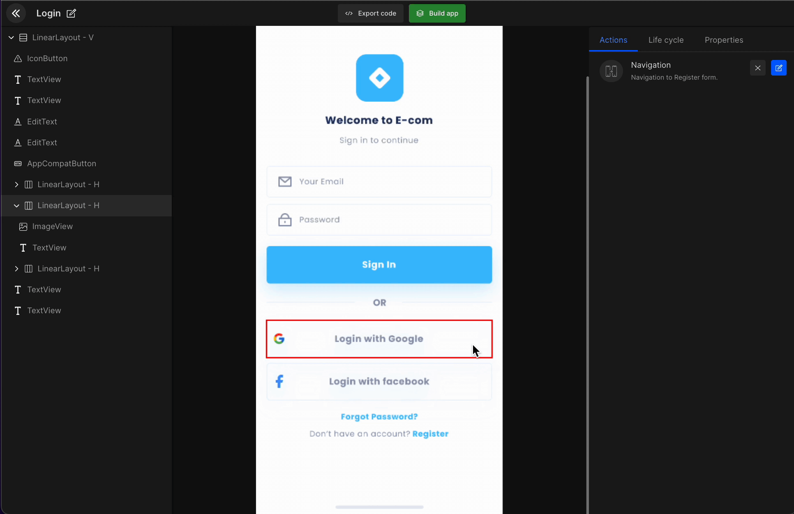
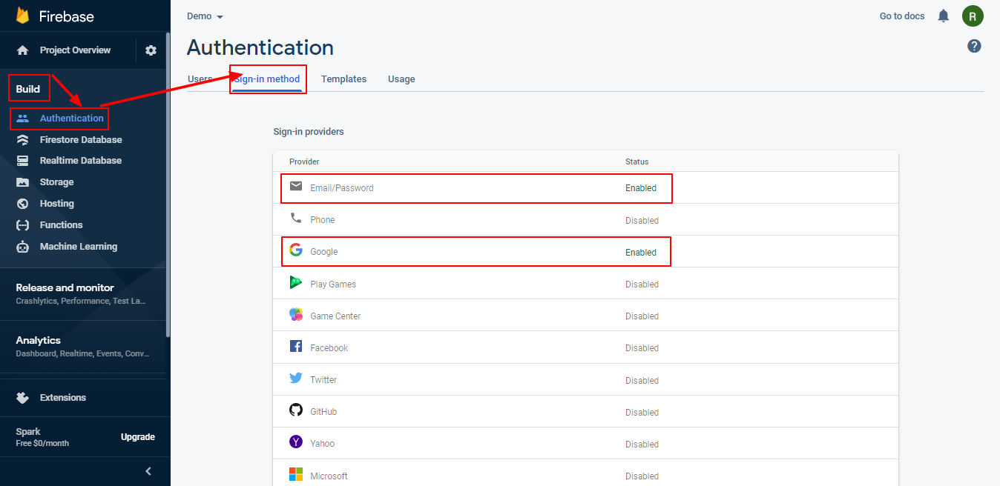

#  Integrate Firebase Social Auth

Implement backend service **Firebase** in your app and help your app run more effectively with it.

<iframe width="100%" height="600" src="https://www.youtube.com/embed/VxQ3lUA1kx8" title="Integrate Firebase account with DhiWise" frameborder="0" allow="accelerometer; autoplay; clipboard-write; encrypted-media; gyroscope; picture-in-picture" allowfullscreen></iframe>

<br/>
<br/>

You can set social authentication (**Google** and **Facebook**) using the action to manage login/register on your app.



<h3>Log in to Firebase account</h3>

Once you are logged in on the left-hand side control panel, click on `Build App`, under it go to **authentication**.

<h3>Authentication</h3>

Click on `sign-in methods`. Select and enable the type of **sign-in providers** or **authentication** you want on your application.

:::tip Example
On many apps the user has the option to login via Google, Email, or Facebook. 
:::

In the below image you can see how to find **authentication** and **sign-in method**. With this, in just a few simple clicks, you can save hours of your time. 





#### Generated code snippet

```js title="firebaseSocialAuth.kt"
 val queryBtnSignIn = firestoreRef
      .collection("users")
      if(viewModel.loginModel.value?.etGroup3Value != null) {
        queryBtnSignIn.whereEqualTo("email", viewModel.loginModel.value?.etGroup3Value!!)
      }
      queryBtnSignIn.orderBy("name", Query.Direction.ASCENDING)
      queryBtnSignIn.limit(100)
      queryBtnSignIn.get()
      .addOnSuccessListener { document ->
        onSuccessBtnSignInQuery(document)
      }
      .addOnFailureListener { exception ->
        onErrorBtnSignInQuery(exception)
      }
 }

 private fun onSuccessBtnSignInQuery(result: QuerySnapshot?): Unit {
    if (result == null) return
    val loginModelValue = viewModel.loginModel.value
    viewModel.loginModel.value = loginModelValue
    val destIntent = DashboardActivity.getIntent(this, null)
    startActivityForResult(destIntent, REQUEST_CODE_DASHBOARD_ACTIVITY)
  }

  private fun onErrorBtnSignInQuery(exception: Exception): Unit {
    when(exception) {
      is NoInternetConnection -> {
        Snackbar.make(binding.root, exception.message?:"", Snackbar.LENGTH_LONG).show()
      }
      is HttpException -> {
        val errorBody = exception.response()?.errorBody()?.string()
        val errorObject = if (errorBody != null  && errorBody.isJSONObject()) JSONObject(errorBody)
        else JSONObject()
        val errMessage = MyApp.getInstance().getString(R.string.msg_something_went_wrong_pl_try_ag)
        this.alert(MyApp.getInstance().getString(R.string.lbl_alert),errMessage) {
          neutralButton {
          }
        }
      }
    }
  }
```

<br/>
<br/>

Got a question? [**Ask here**](https://discord.com/invite/rFMnCG5MZ7).