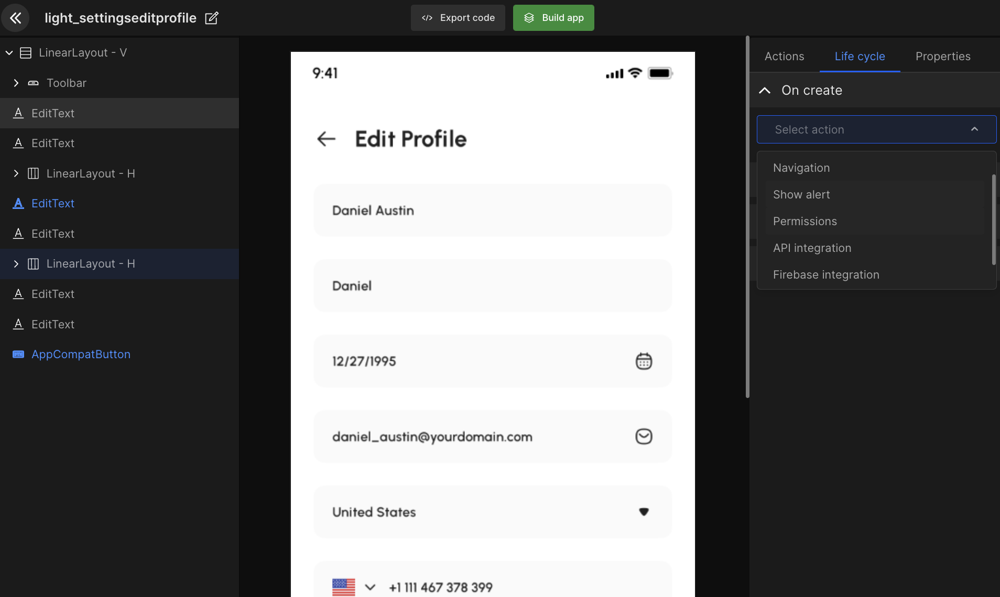
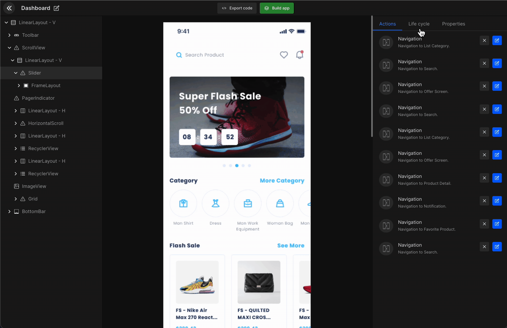
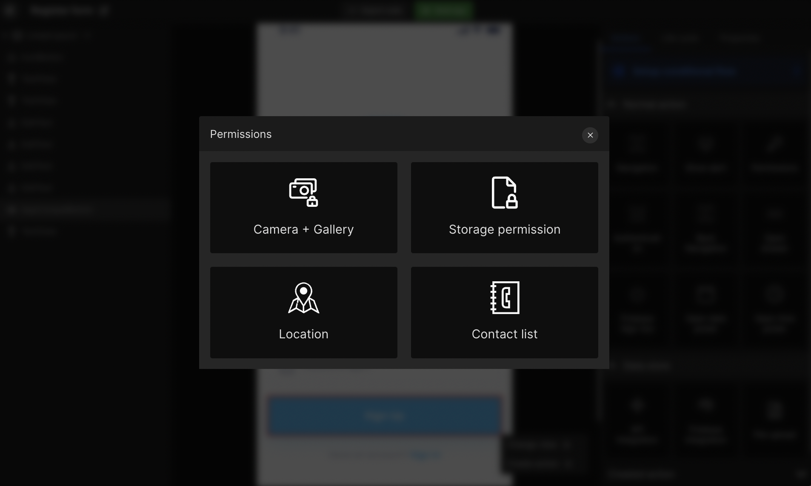

import navigationImg from "./img/navigation.png"
import ApiIntegrationImg from "./img/APIIntegration.png"
import FirebaseImg from "./img/FileUpload.png" 
import PermissionImg from "./img/Permission.png"
import AlertImg from "./img/Alert.png"
import SocialAuthImg from "./img/Authentication.png"

# Manage App Lifecycle

<h3>Manage the life cycle option under screens,</h3>

Select the On create option and it will show you a dropdown with multiple actions. Select required action and start creating a life cycle.

Currently, the DhiWise Android app builder supports only the **onCreate** Method. However, the **onPause**, **onStop**, and **onDestroy** methods are scheduled to release soon.

Below is the list of actions supported in the life cycle:

      <a className="Card" href="#api-integration">
        
        <h4>API Integration</h4>
      </a>
      <a className="Card" href="#firebase-integration">
        
        <h4>Firebase Integration</h4>
      </a>
      <a className="Card" href="#navigation">
        
        <h4>Navigation</h4>
      </a>
      <a className="Card" href="#permissions">
        
        <h4>Permissions</h4>
      </a>
      <a className="Card" href="#alerts">
        
        <h4>Show Alert</h4>
      </a>
      <a className="Card" href="#authentication">
        
        <h4>Social Authentication</h4>
      </a>
    

     

## What is bind data from preference?

This feature allows developers to showcase the data along with API integration to showcase them at other places in your application.

:::info

- For example, At the time of registration, if someone inputs their email or number, and then on the profile page, we can show the same details again without the need to fetch the same data again with the help of bind data from preference.

- While API integration whatever data you save in preference you can use that data again to showcase at other places using this feature.
:::

<iframe width="100%" height="500" src="https://www.youtube.com/embed/T8geG8EvCjM" title="Preference to view | Bind API response to design UI" frameborder="0" allow="accelerometer; autoplay; clipboard-write; encrypted-media; gyroscope; picture-in-picture" allowfullscreen></iframe>

## Navigation

- Select "Navigation" and it will show a list of all the application screens, and you can select any particular screen to map out the user path. <a href="/docs/android/navigation">Learn more</a>

- Also, you can directly search the navigation screen and manage close screen status.

- Add fragment or replace a fragment 

- Choose transition animation 

:::tip Example
Whether to close all previous screens or only the previous screen.
:::

Another option is choosing the **delay time** and the **transition** where you can select **in and out animation**.

The life cycle set on any screen will be displayed as below. Also, you can edit or delete any particular action.

## Alerts

You can set up an "**Alert dialog**" for any UI component by entering "**Title**" and "**Message**". <a href="/docs/android/show-alert">Learn more</a>

## Permissions

You can set **Camera**, **Gallery**, and **Contact list** access permission for any UI components. <a href="/docs/android/add-permissions">Learn more</a>

## API Integration

You can add API in any screen by selecting API from creating action or **onCreate**. However, first, you should have added your API postman file or added APIs manually from the API integration feature. <a href="/docs/android/api-integration">Learn more</a>

#### Step 1: 

Search the API you want to access. Then select the required **header**, **parameter**, and **body**. Now you have to add a response as seen in the below gif

#### Step 2: 

Manage response data and bind it to the respective view. Select the required **key** and **view**. 

#### Step 3:

Manage the action you want to perform on the success or error of your API call. In dropbox, it will show you the options which we have already covered like <a href="docs/android/navigation">Navigation</a>, <a href="/docs/android/show-alert">Show Alert</a>, <a href="/docs/android/add-permissions">Permissions</a>, and such.

      <a className="Card" href="docs/android/navigation">
        
        <h4>Navigation</h4>
      </a>
      <a className="Card" href="/docs/android/show-alert">
        
        <h4>Show Alert</h4>
      </a>
      <a className="Card" href="/docs/android/add-permissions">
        
        <h4>Permissions</h4>
      </a>
    

 

## Authentication

You can set social authentication (**Google** and **Facebook**) using the action to manage login/register on your app. <a href="/docs/android/integrate-firebase-social-auth">Learn more</a>

## Firebase Integration

To integration Firestore, It is required you first add the required postman file in the Cloud Firestore integration. <a href="/docs/android/firebase-integration">Learn more</a>

 
 

Got a question? [**Ask here**](https://discord.com/invite/rFMnCG5MZ7).