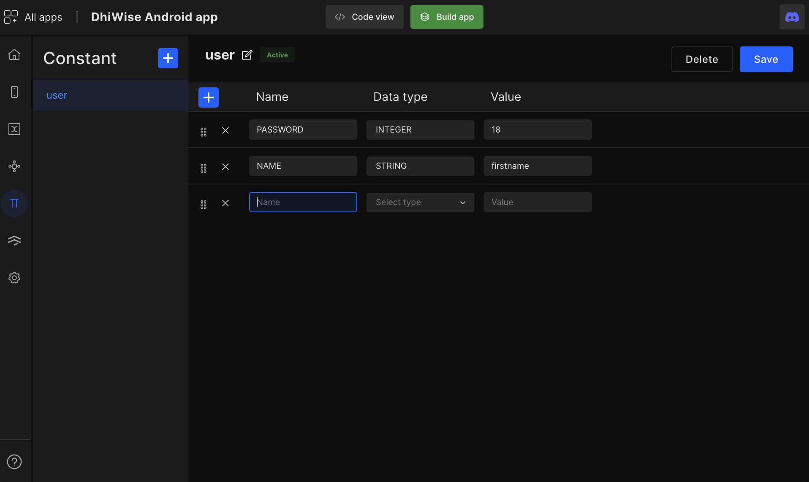

# Constant

## Manage multiple constant files

To create a constant, click on the ➕ icon on the constant page, add "**Constant name**" and "**Description**".

Click on the `Create constant` button to save and create a constant file.

## Add constant

You can add as many constants as you want. You need to add the below 3 details to add a constant : 

#### Name
Add a name of constant (Only CAPS and _ is allowed)

#### Data type
Select data type based on the value. Allowed data types are as below : 

`INTEGER | STRING | FLOAT | DOUBLE | BOOLEAN`

#### Value
Add the value of the constant

You can move constants up and down by dragging them. Remove constant by clicking on "X" remove icon beside.

- Click on `Save` to add constant values. 

- Click on the `Edit` button to update the constant file name or description.

 
 

Got a question? [**Ask here**](https://discord.com/invite/rFMnCG5MZ7).