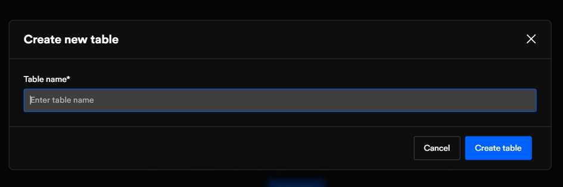

# Database

The database is the most common way of storing and managing data. In most cases, databases are managed on the server-side and mobile applications communicate with them through the network. In case of internet unavailability, such an application doesn't work.

Implementing a local database helps to manage such problems. The local database can be used to sync and store data on mobile devices or to manage offline features of the apps. This will help to make applications fast and work offline or on low internet connectivity.

DhiWise Android app builder supports **Room DB**, code generated with local database table will be in Room DB.

## Create a table

Click on the ➕ icon on the database page, add "**Table name**" and "**Table description**".

Click on the `Create table` button to save and create a database table.

## Database table attributes

You can add as many attributes as you want. You need to add up to 6 details to add an attribute:

<table>
    <tr>
        <td>Attributes</td>
        <td>Add the name of an attribute.</td>
    </tr>
    <tr>
        <td>Data type</td>
        <td>Select data type based on the value. Allowed data types are as below:  
        <code>INTEGER | STRING | FLOAT | DOUBLE | BOOLEAN | Array | Relation</code>
        </td>
    </tr>
    <tr>
        <td>Value</td>
        <td>For array and relation, you can define the relation or value array by selecting the respective table. </td>
    </tr>
    <tr>
        <td>Default</td>
        <td>Select default, it can be <b>null</b> or <b>user-defined</b>.</td>
    </tr><tr>
        <td>N (Nullable)</td>
        <td>Generate variable that allows null value.</td>
    </tr>
    <tr>
        <td>P (Primary key)</td>
        <td>Define primary index of the table (Nullable attribute can't be a primary key)</td>
    </tr>
</table>

#### You can move attributes up and down by dragging them.

- Remove it by clicking on the "X" remove icon beside.

- Click on `Save` to add attribute values.

- Click on the `Edit` button to update the constant file name or description.

All the database tables are listed in the left panel, you can switch from one file to another just by clicking on the table name.

 
 

Got a question? [**Ask here**](https://discord.com/invite/rFMnCG5MZ7).