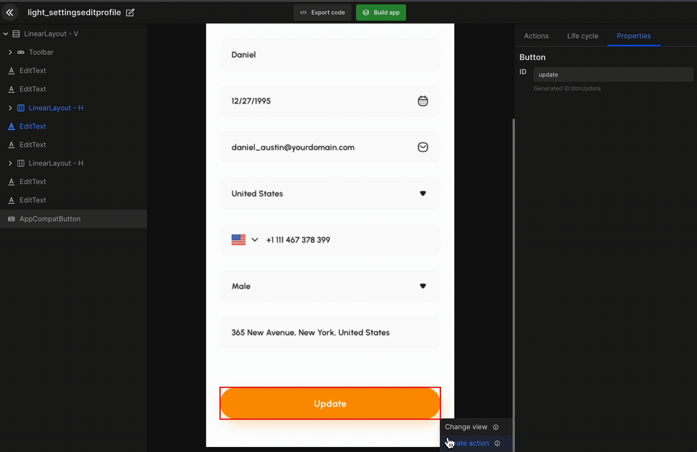
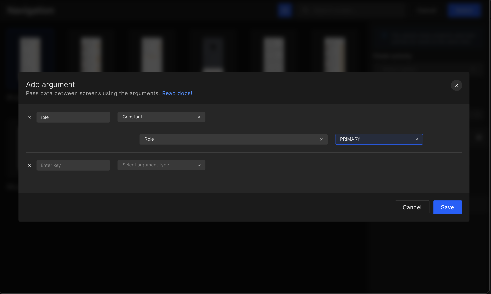
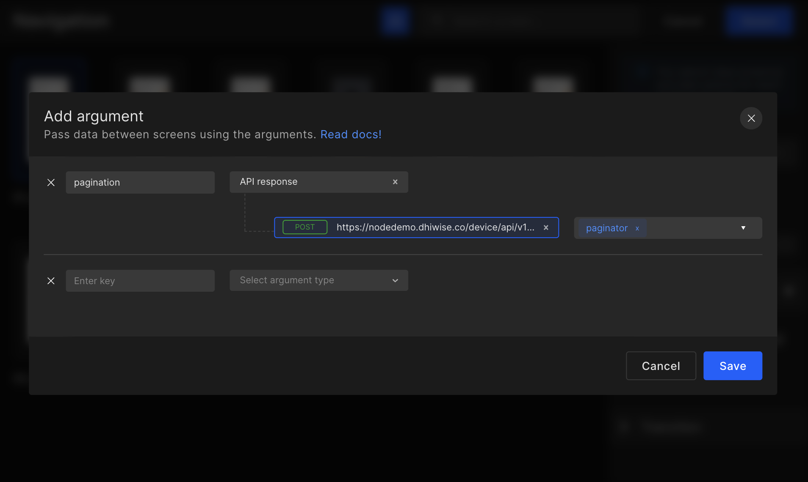
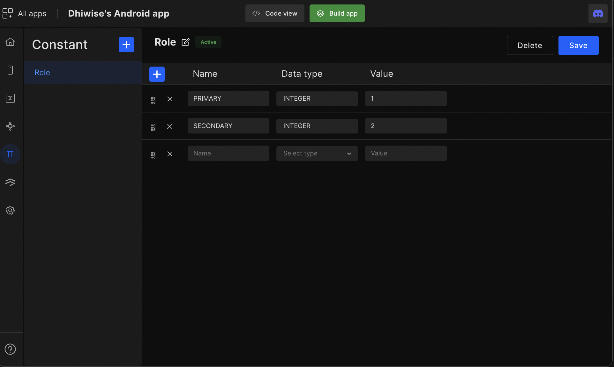
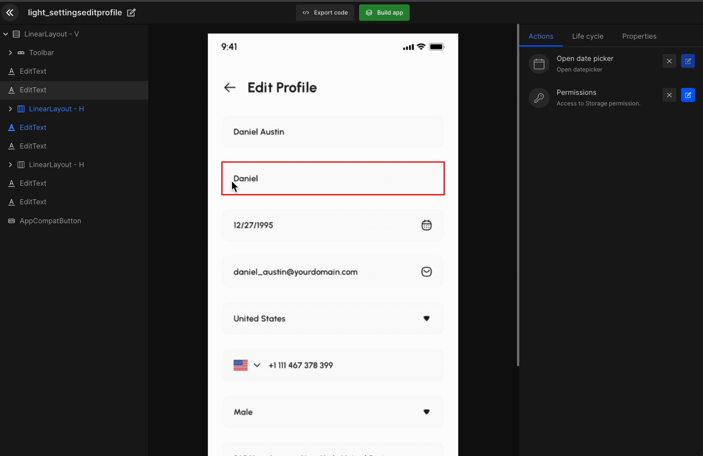

# Navigation

Navigation makes applications more interactive, which helps users navigate in, out, and across the app.

## **Add Navigation**

#### **Step 1:**
Click on `Configure` in the **screens** feature.

#### **Step 2:**
Select the **view component**.

#### **Step 3:**
Click on `Create Action`.

#### **Step 4:**
Select `Navigation`.

The next page will consist of all the screen in your app. Among them select the screen you wish to navigate to. Additionally, you can configure the **transition**, **finish activity**, **launch more**, & **arguments**.

- <e className="hightlight">Transition</e>:

    Select the **in animation** & **out animation** while navigating to different screens.

- <e className="hightlight">Finish activity</e>:

    Select whether to close all background screen activity or only the previous screen activity.

- <e className="hightlight">Launch mode</e>:

    Select launch mode type; **standard**, **single top**, or **single task**.

Once done, click on `Select` to move to the screens page and set up other actions.



## **Navigation with Arguments**

The add navigation feature will allow developers to share data from the present screen to the screen they are navigating to. The data will be received from constants, API response, & navigation arguments.



<h3>What is data sharing</h3>
Share the current screen data to another screen without the need for storing it. The data which can be set from one screen to another are **API Response**, **Navigation Argument**, and **Constant**.

<br/>
<br/>

<iframe width="100%" height="500" src="https://www.youtube.com/embed/FJlOf5F_kCw" title="Data sharing in DhiWise | Navigation argument" frameborder="0" allow="accelerometer; autoplay; clipboard-write; encrypted-media; gyroscope; picture-in-picture" allowfullscreen></iframe>

### How to add an argument using API response?
Let's suppose you want to show the order details on the checkout page without retrieving data from the server n number of times, you can easily share the same data through selecting **navigation > argument > API responses**.

:::info
The app screen should have API integrated for the API response to be fetched in the add argument.
:::



### Add navigation argument using constant

Another way of passing data between screens is through constants. Create a constant in the constant feature, then go to the screens feature and select the screen from which you wish to pass the data into the other screen using **create action > navigation > add argument > constants**.




## **Back Navigation**

The back navigation action will take you to the previous screen. Implement this action on the back navigation view component in your app design.

Follow the below steps starting from your dashboard screen.

#### **Step 1:**
Go to **screens**.

#### **Step 2:**
Select the required screen.

#### **Step 3:**
Click on `Configure`.

#### **Step 4:**
Select the **Back Navigation** component.

#### **Step 5:**
Click on **create action**.

#### **Step 6:**
Select `Back Navigation`.

Actions set on any screen will be displayed as below. Also, you can edit or delete any particular action.



#### Generated code snippet

```js title="navigation.kt"
//navigation without parameters/transitions
val destIntent = LoginActivity.getIntent(this, null)
startActivity(destIntent)

//navigation with API response as parameters
 val destBundle = Bundle()
destBundle.putString("username",viewModel.createLoginLiveData.value?.getSuccessResponse()?.data?.username)
val destIntent = ProfileActivity.getIntent(this, destBundle)
startActivity(destIntent)

//navigation with transition
val destIntent = LoginActivity.getIntent(this, null)
startActivityForResult(destIntent, REQUEST_CODE_LOGIN_ACTIVITY)
this.overridePendingTransition(R.anim.left_to_right ,R.anim.right_to_left )
```


<br/>
<br/>

Got a question? [**Ask here**](https://discord.com/invite/rFMnCG5MZ7).