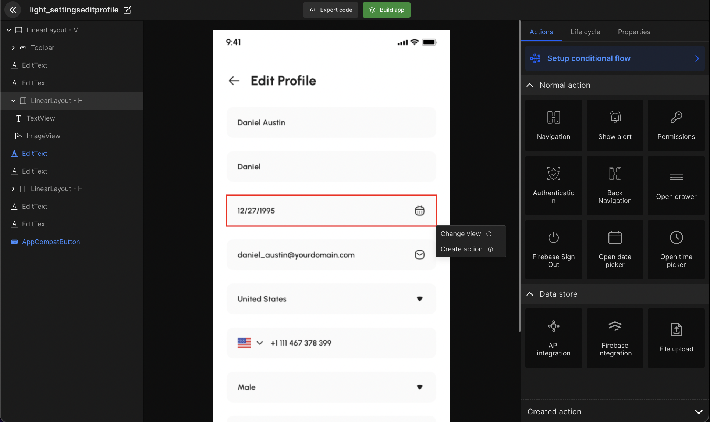

# Open Date & Time Picker

Display the date and time in your app. Select view component for the date & time. Convert the date and time picker view components with a single click. 



#### Generated code snippet

```js title="dateTimePicker.kt"
// time picker
val destinationInstance = TimePickerFragment.getInstance()
      destinationInstance.show(this.supportFragmentManager, TimePickerFragment.TAG) {
          selectedTime ->
        onTimeSelectedBtnSignIn(selectedTime)
      }


// date picker
val destinationInstance = DatePickerFragment.getInstance()
      destinationInstance.show(this.supportFragmentManager, DatePickerFragment.TAG) {
          selectedDate ->
        onDateSelectedImageLogo(selectedDate)
      }      

// the need to add helper class      
```


<br/>
<br/>

Got a question? [**Ask here**](https://discord.com/invite/rFMnCG5MZ7).