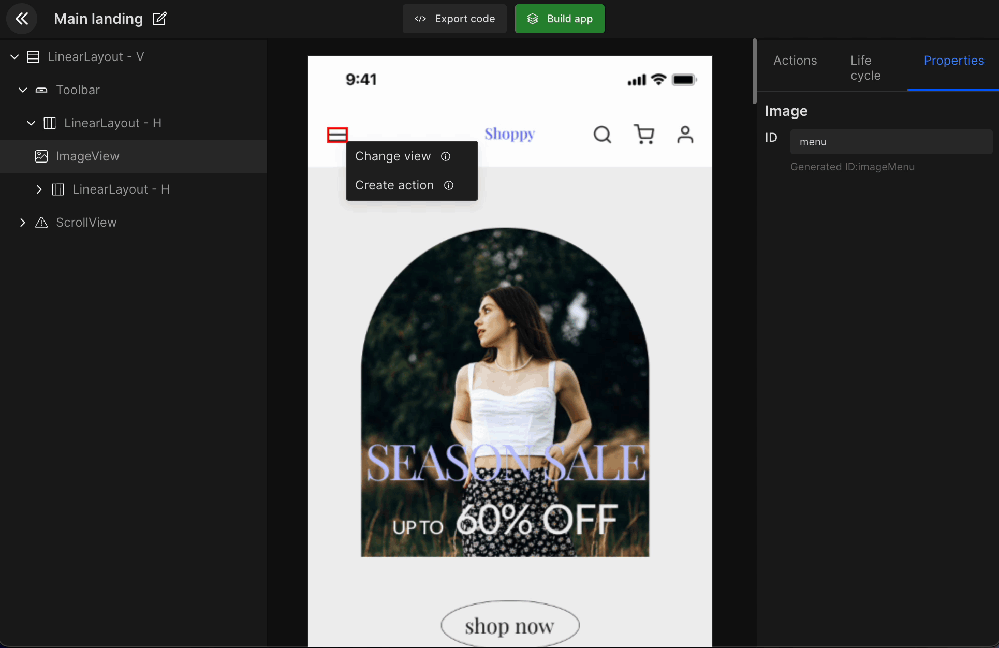

# Open Drawer

DhiWise will auto-identify any app screen design in your app that is a **DrawerItem** **screen**. However, if the screen is not identified as a DrawerItem, or if you wish to convert any particular screen to a DrawerItem then you can manually change it by selecting the **UI component > change view > DrawerItem**.

## How to set up Open Drawer

In order to add the open drawer to your desired screen UI component, you will have to pick a **DrawerItem** **screen** from your app design. For example, we have a drawerItem which includes a menu to navigate to different screens in the app. Now we wish to add it to a UI component that is constant. 

 
 

Got a question? [**Ask here**](https://discord.com/invite/rFMnCG5MZ7).