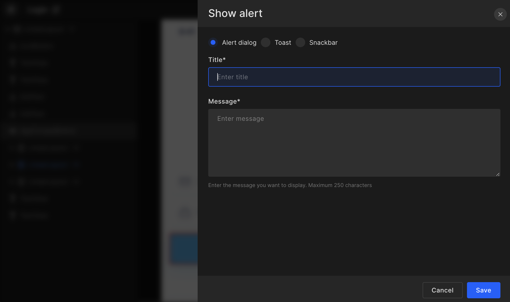

# Show Alert

Developers can set up **Alert dialog**, **Snackbar**, or **Toast** for any UI component by entering "**Title**" and "**Message**" for the alert dialog and only "Message" for Snackbar or Toast.

For Alert dialog, you can add up to 250 characters message and for a snack bar or toast, you can add a message up to 100 characters.

Click on `Save` to move to the screens page and set up other actions.



#### Generated code snippet

```js title="dialog.kt"
//Alert
this.alert(MyApp.getInstance().getString(R.string.lbl_alert),
    MyApp.getInstance().getString(R.string.lbl_hello_world)) {
        neutralButton {
        }
    }

//Toast
Toast.makeText(this,MyApp.getInstance().getString(R.string.lbl_hello_toast),Toast.LENGTH_LONG).show()

//Snackbar
Snackbar.make(binding.root, MyApp.getInstance().getString(R.string.lbl_hello_snack_bar),
Snackbar.LENGTH_LONG).show()
```