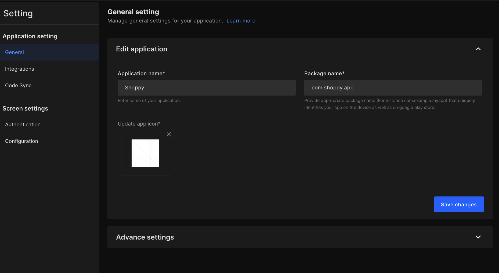
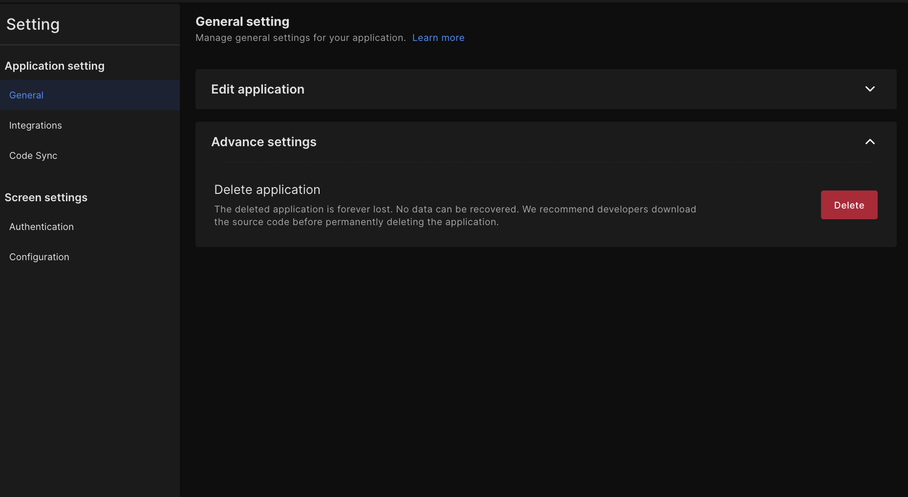
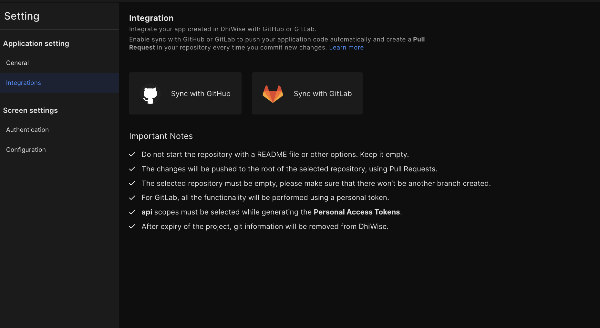

# Edit or delete mobile apps
After completing the development of your application, you may want to edit application details, or want to sync the application code to GitHub or GitLab. The below documentation will help you with these settings. 

:::info
The below document represents the settings for all the mobile technologies as well as the **Figma to React app** builder in DhiWise.
:::

<h3> Go to setting </h3>
Under settings you have two options, i.e. "Application edit" and "Advanced".

## Application edit
You can edit the application name, package name, description, and app icon. (The options may vary according to the app builder.)

## Application name
Add a name that you want to show in your app's listing on Google Play or on the mobile home/menu screen when someone installs the app.

## Package name
Package name/Application ID is a unique identifier that uniquely identifies your app on the device and in Google Play Store.

## Upload app icon
The app icon is displayed in your app's listing on Google Play or on the mobile screen home/menu screen when someone installs the app.
## Advance
To delete the application permanently, go to settings, under advance options, click on the "**Delete**" button. A confirmation pop-up will open to confirm your action.

:::note
Note: Once the application is deleted it cannot be recovered. It is deleted forever. 
:::

## Integrations
Below to general setting, you will find another set i.e. "**Integrations**", from here you will be able to sync your application code from the DhiWise platform to **GitHub** or **GitLab**.

Click on the "**Sync with GitHub**" or "Sync with GitLab" button to start syncing your code to the respective tool.

For authentication and configuration, refer the below page. 
 

    <a className="Card" href="/docs/appresources/app-settings/mobile-app-authentication">
      <h4>Mobile app authentication</h4>
    </a>   

 
 

Got a question? [**Ask here**](https://discord.com/invite/rFMnCG5MZ7)
