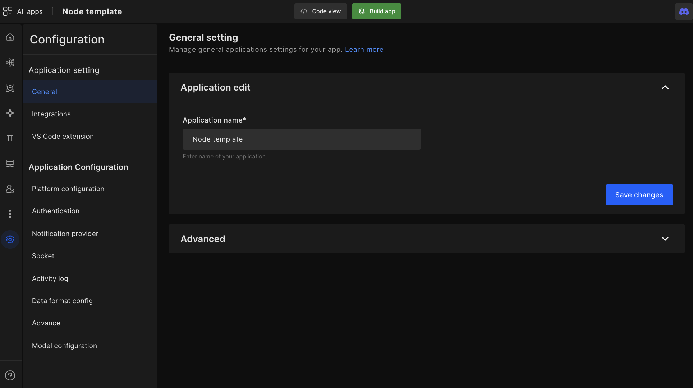
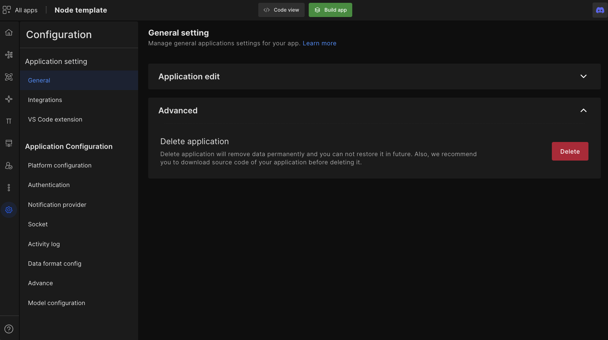
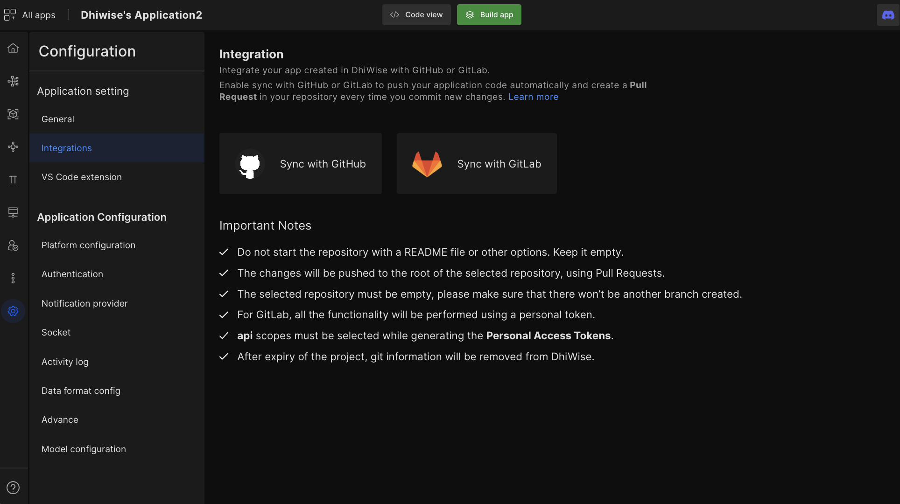

# Edit or delete backend apps

#### In general setting are two options i.e "Application Settings" and "Application configurations".

General settings

## Application Edit 
 You can edit the application name and description from here.

## Advance
To delete the application, go to general setting > advanced option.

- Click on the "**Delete**" button to permanently remove your data.

:::info
You can not recover/restore your application in the future. (We recommend you download the source code of your application before deleting it.)
:::

## Integrations

You will find "**Integrations**", from here you will be able to sync your application code from the DhiWise platform to **GitHub** or **GitLab**. Click on the "**Sync with GitHub**" or "**Sync with GitLab**" button to start syncing your code to the respective tool.
 

 
Got a question? [**Ask here**](https://discord.com/invite/rFMnCG5MZ7)