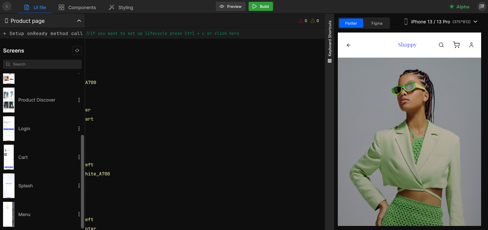
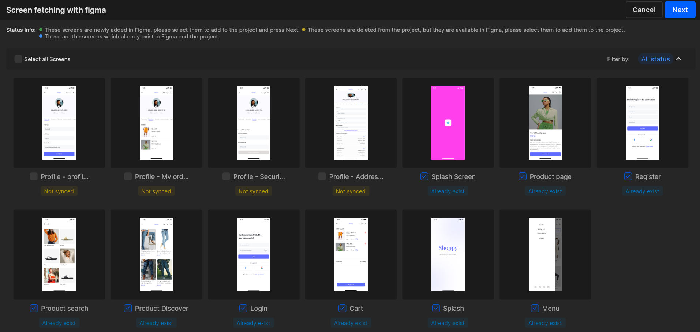
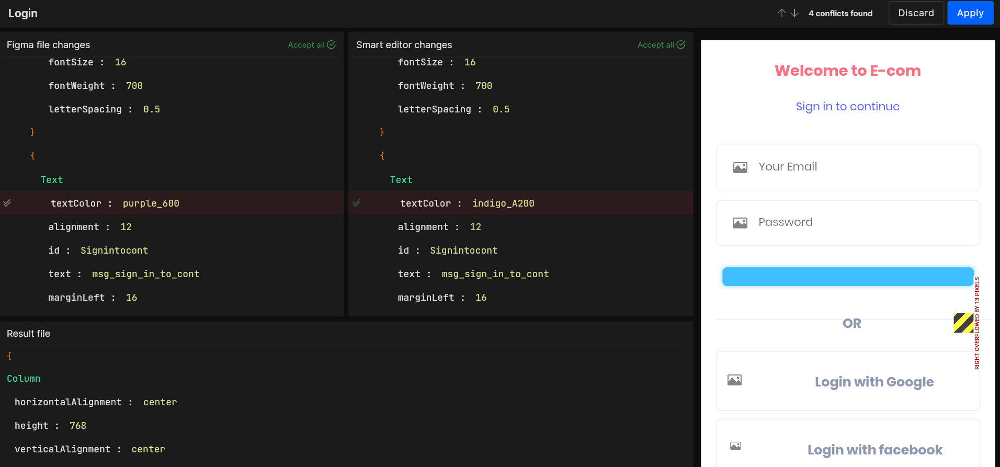

# Figma Refresh

Figma Refresh helps you to avoid switching back to Figma designs repeatedly and creating a new app in DhiWise again to bring all your new design changes. It helps to save a lot of time in a single click and helps you get your modified design right here all the way from the Figma file. No need to switch to the design file for it, we have covered all right here.

## How to refresh Figma file?

#### Step 1:

In your created application, for a screen, open the screen list from which you will find a refresh 🔄️, on the top right as shown below.

Click on the icon and Figma refresh process will start.

#### Step 2:

As it start fetching the design changes, it will first show you the screen details. All the new **added** screens, **existing** screens and the ones which are **removed**, are shown here and you can easily add them. Just simply select as your need and click **`Next`** to proceed with the screens. 

**Easy to view Screen Details**

Below is the design where you can see the easy screen detailings for the Figma Refresh option and add **new** or **remove** screens from your application.

#### Step 3:

As you click `Next`, it will start to fetch all your design changes. But if there are some **conflicts** while fetching the changes, it will show you the conflicts which are needed to be resolved to proceed further.

**Resolve Design Conflicts and Live Preview Changes** 

Here you need to accept the changes which are fetched from the Figma and set the new changes in your app design in DhiWise. As shown below, it will show you both designs as in an IDE from which you need to accept the changes like that in a merge request, and will also let you see the result file after the changes are made in the below area with a **live preview** of the design on the right.

:::tip
**Live preview** of design changes makes it so easier to resolve the changes.
:::

#### Step 4:

Next, click on `Apply` and your design changes done in the Figma file are fetched in your application.

 
 

Got a question? [**Ask here**](https://discord.com/invite/rFMnCG5MZ7)
