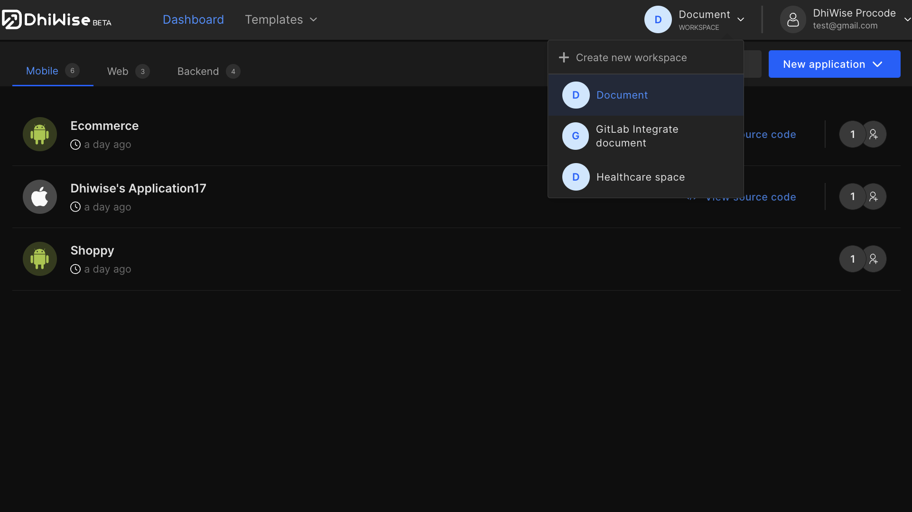
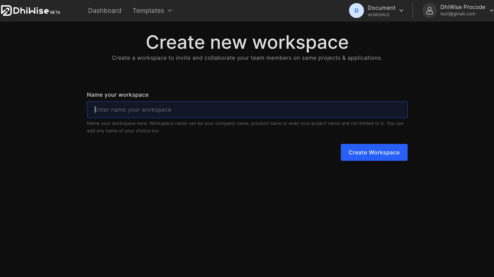

# Create a new workspace

<a href="https://app.dhiwise.com/sign-up" target="_blank">Sign in</a> to DhiWise and click on the profile icon at the top right. Then click on the "+" icon to add a workspace as shown in the screenshot below. 

 

## Name your workspace

Name your workspace here. Workspace name can be your company name, product name, or even your project name and not limited to it. You can add any name of your choice too.

Add your workspace name and click on "**Create**", your workspace is created.

:::info 
Developers can access DhiWise for free and access full platform features. We want you to use DhiWise for free and then decide to purchase the subscription.
:::

Got a question? [**Ask here**](https://discord.com/invite/rFMnCG5MZ7)
