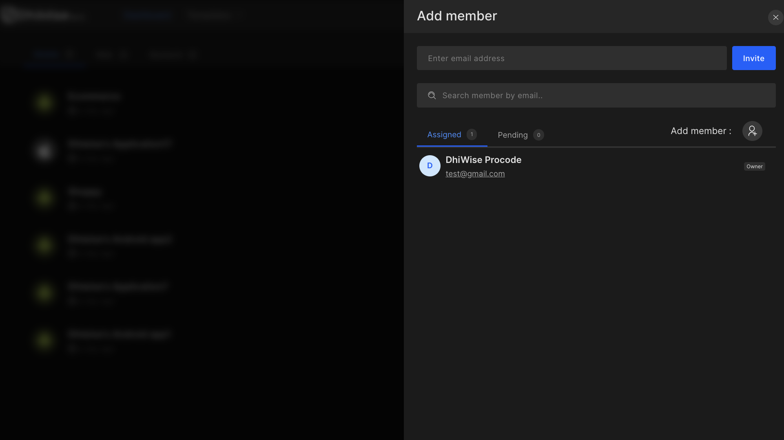

# How to invite people to my Workspace?

1. Workspace owners can invite new people as members. Read on for more details!

2. Click on your profile avatar in the right upper corner.

3. Click on "Edit Profile".

4. Click “Invitations” from the Settings menu that appears.

5. Click on Send Invitation to invite your team members on DhiWise to collaborate on existing projects and to create and manage new projects.

6. Enter their email and they will receive an email.

7. You will be able to see the invited user in the "Pending" tab.

8. If you need to resend an invitation for any reason, click on "Resend".

Got a question? [**Ask here**](https://discord.com/invite/rFMnCG5MZ7)
