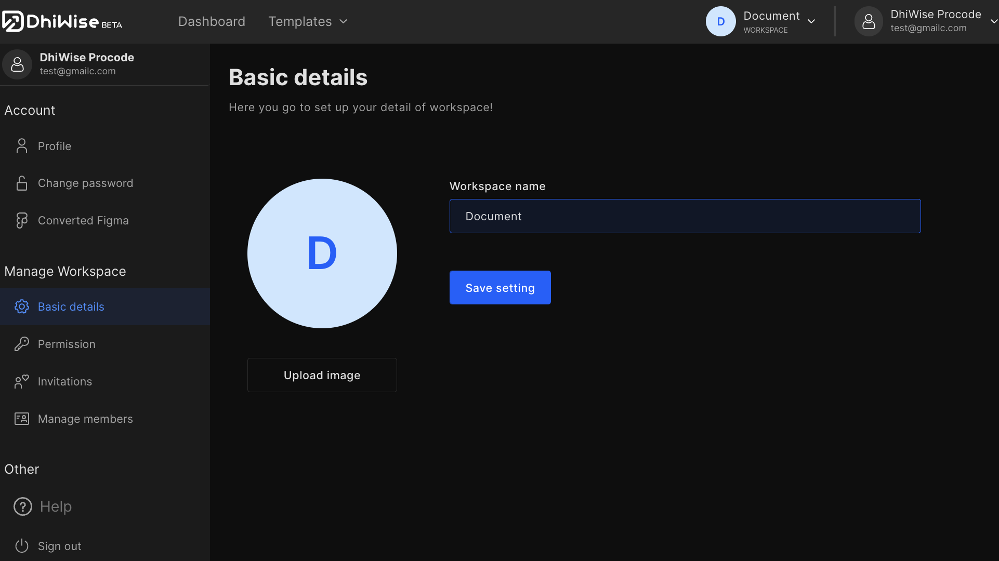
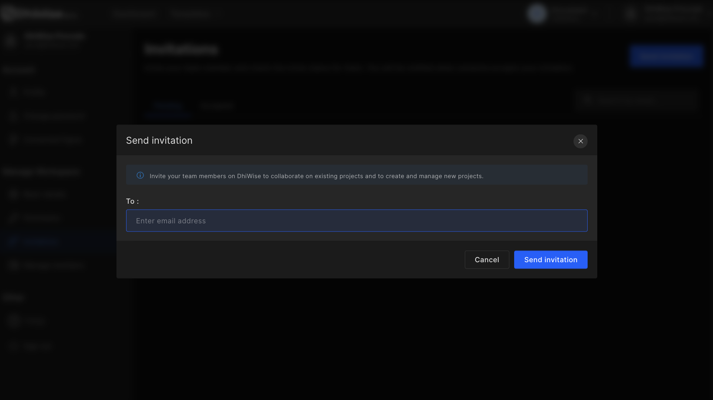
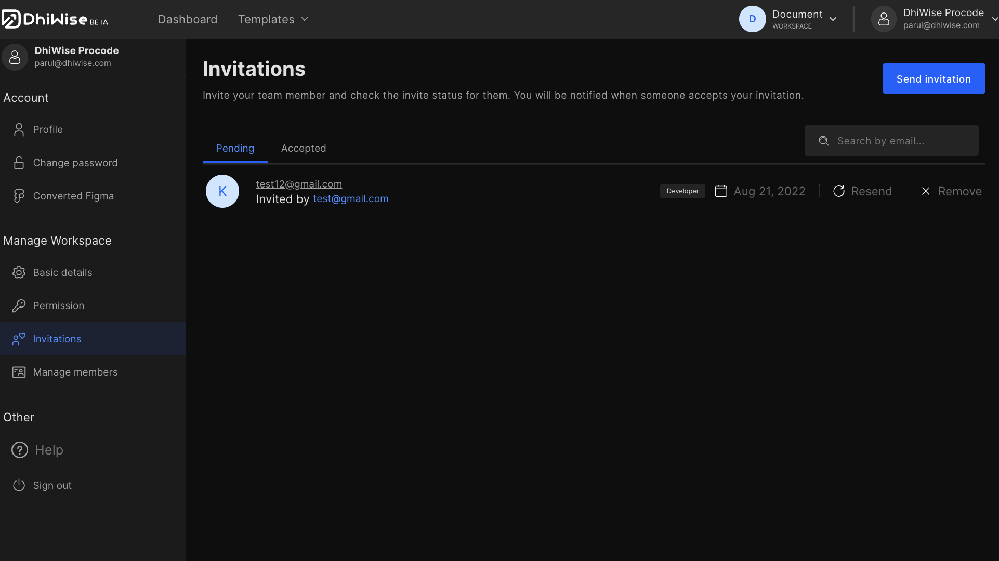

# Manage a workspace

## Configure your workspace to suit your requirements

Click on the profile icon on the top right and click on "**Edit profile**" from the dropdown menu to manage the workspace. On the left panel, you will find four options under "**Manage Workspace**".

- **Basic Details**

 Update the workspace name and icon/image for the workspace from basic details.

- **Permission**

 Set up permissions for the users to access any particular workspace.

- **Invitations**

 Invite your peers to work with you via their emails. <a href="/docs/appresources/app-settings/manage-workspace/how-to-invite-people-to-my-workspace" target="_blank">Click here</a> to know more about sending the invite.

 

- **Manage members**
 You can remove, deactivate, or reactive members from your workspace.

 

 Got a question? [**Ask here**](https://discord.com/invite/rFMnCG5MZ7)
    