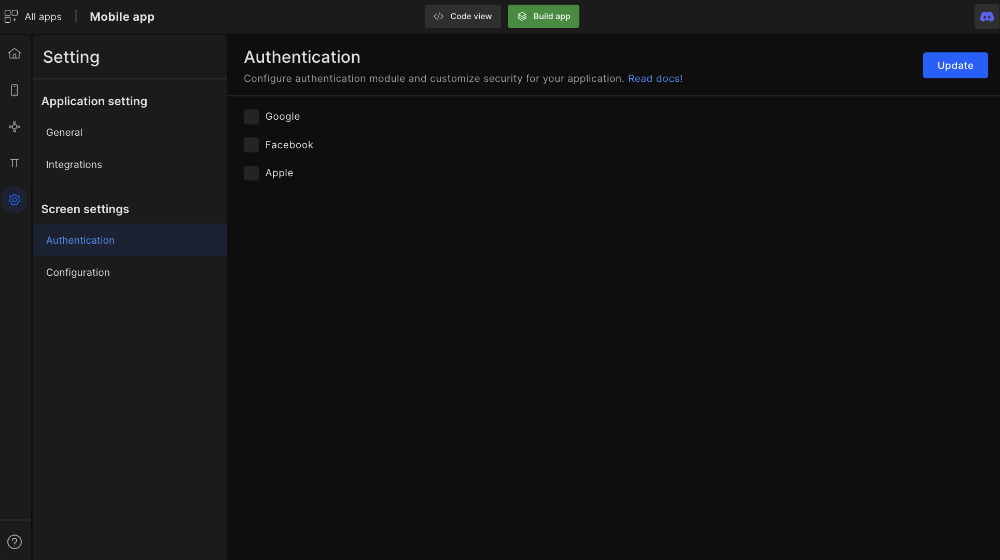
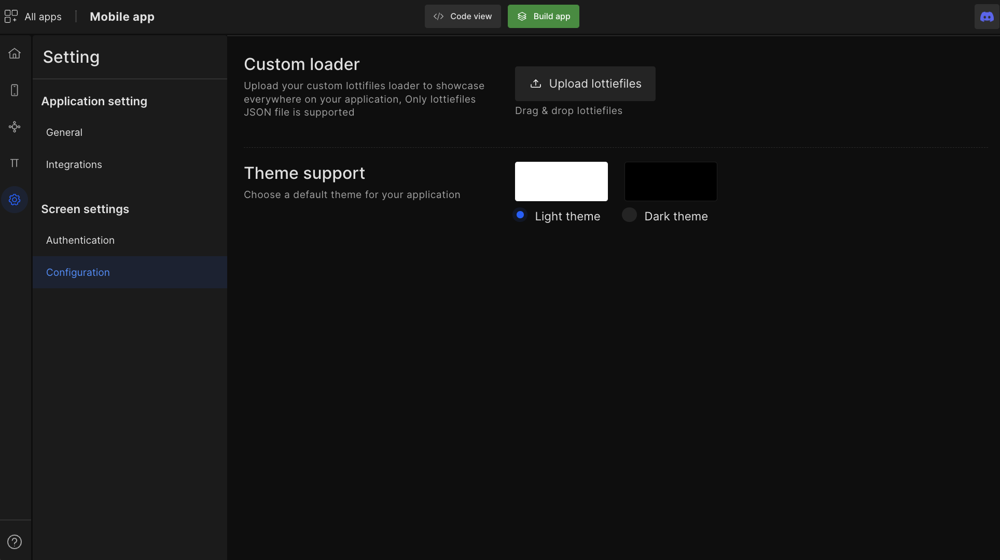

# Mobile app authentication

## Social and biometric authentication
The DhiWise Android app builder provides the facility to add biometric authentication and log in with the social media (Google and Facebook) option in just a click.

<h3> Go to settings </h3>

To apply biometric authentication to your app, click on the **checkbox** and then click on `Update` to save the configuration.

## Custom Loader
Upload your custom Lottifiles loader to showcase everywhere in your application; Only lottiefiles JSON file is supported.

## Theme support
Choose a custom theme for your application.

## Firebase Crashlytics
Enable a real time crash reporting tool to help you fix the most pervasive crashes based on the impact on real users.

 
 

Got a question? [**Ask here**](https://discord.com/invite/rFMnCG5MZ7)
