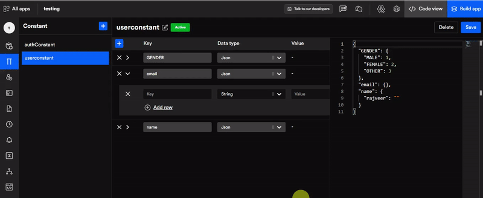

# Constant

A constant helps you avoid rewriting the same code multiple times across your application. For example, most apps require authentication either from the admin or the user. Therefore, once you have defined a constant for authentication you can use it across your application. With the help you DhiWise you can easily create and manage multiple constants.
## Constant 
In the below image you can see "**authConstant**" which is auto-generated by DhiWise. You can click on the **(+)** icon to create your own constant.

.png)

## Create constant file for models
Then give your constant a **name** and a **description** and click on **create constant** and start coding. It's that simple. 

Got a question? [**Ask here**](https://discord.com/invite/rFMnCG5MZ7)