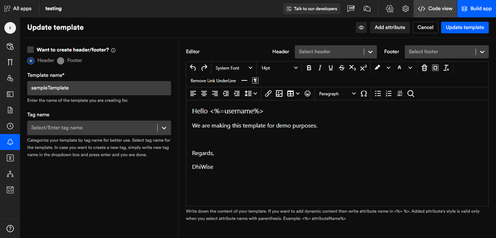
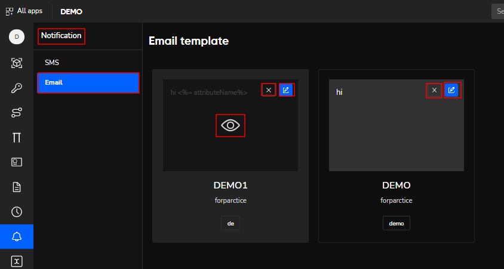
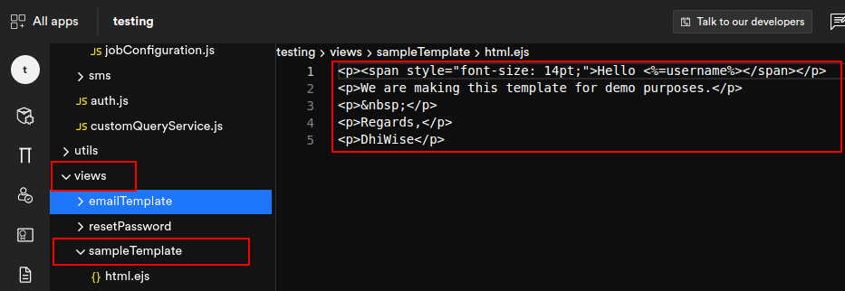

# Email notification templates
Nowadays, we expect instant communications especially with email because a lot depends on it. Therefore, on DhiWise, we have created a way for this essential feature to be on your app hassle-free with just a few clicks.  

## Add Email template

**fill in the template name, tag name, description, and editor, then click on create template. In that same way, you can create your email template as well.**  

- **Header/footer**: Create a specific headline or footer across all your email to showcase whatever you wish.  

- **Template name**: Enter the name of the template you are creating for. e.g offer deals or OTP codes. 

- **Tag name**: Categorize your different email templates by **tag names** to easily distinguish between them, for example, shipping order, account balance, etc.

- **Description**: Give your templates a brief description. It makes them easy to understand in the future. 

- **Editor**: Write down the content of your template. If you want to add dynamic content then write attribute name in <%= %>. Added attribute's style is valid only when you select attribute name with parenthesis. Example: <%= attributeName%> In the below image you can see the examples clearly. Here in the **email template editor**, you get a plethora of options to customize your text.

 
# Add attribute
Once you click on **add attribute** a side panel will appear where you can see the attributes you have input in the editor to which you can assign model attributes, for example, username, name, email, and password.

After creating the email template developers can preview, edit, or delete it. 

## DhiWise generated email template code

Got a question? [**Ask here**](https://discord.com/invite/rFMnCG5MZ7)

