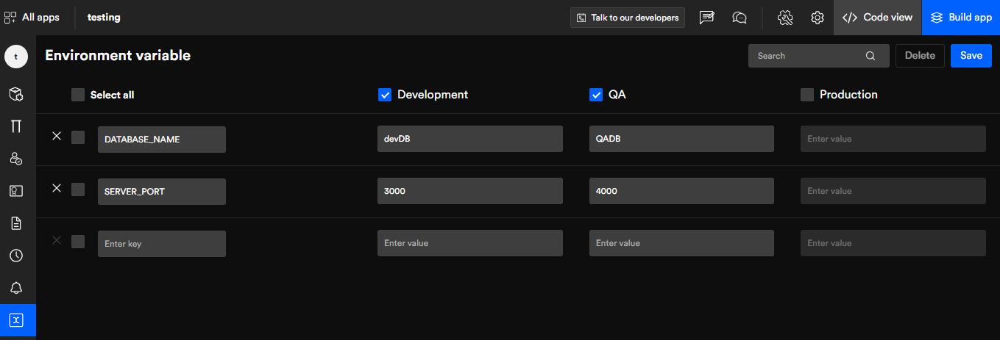

# Environmental variables
Environment variables represent different versions of your application that you expect to co-exist on a single application.

>**To err is a human**, having said that developers encounter multiple issues that takes a significant amount of time to debug. In some cases, the running system stops working upon a new release and most of the time it happens because of ill-managed environment variables.

An application consists of multiple third parties like email, SMS, payment gateway, push notifications, and many more. In an ideal scenario, different API keys are being used according to the app versions.

## Manage different environment variables: 
- Development
- QA
- Production

Select any of the environments you require and add a **key**, then just need to enter a **value** for the selected environments.

Click on "**Save**" once you are done adding the details. You can add/edit/remove values at any point in time.

Got a question? [**Ask here**](https://discord.com/invite/rFMnCG5MZ7)