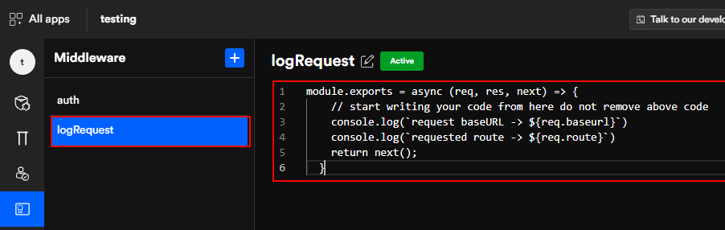
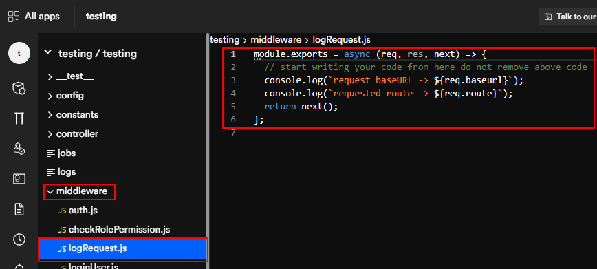

# Middleware

Before sending any HTTP request, middleware helps you filter that request; First, authenticating it, then letting it through. 

On our platform, you will get Express middleware with functionality such as application-level middleware, route-level middleware, error-handling middleware, third-party middleware.  

## Go to middleware 
Under middleware, you will get a list of all the middleware you've created. The authentication middleware is an auto-generated code. 

If you wish to create your own middleware code, you can click on the (+) symbol.

 

## The middleware code

You can see the output of the "logRequest" middleware in the DhiWise generated code.

 

Got a question? [**Ask here**](https://discord.com/invite/rFMnCG5MZ7)
