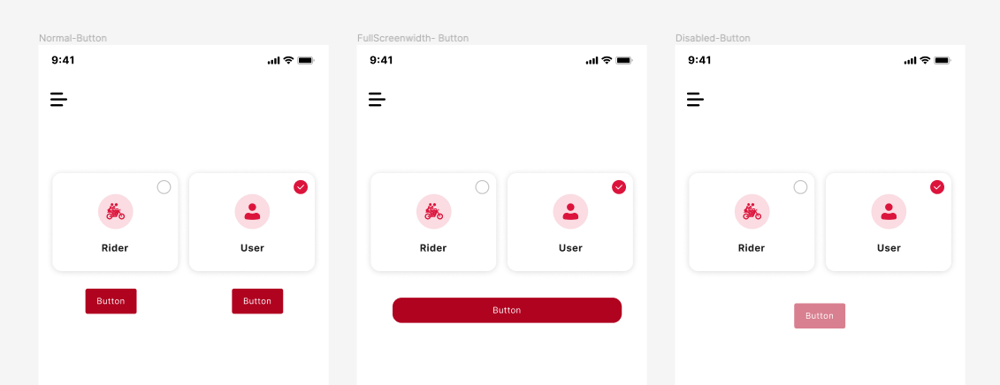

# Package

The package NPM (Node packages manager) feature helps developers directly downloads any Node.js package from our platform itself. 

## Add custom packages NPM

- Choose the type of dependency you want either **dev-dependency** or just **dependency**. 

- Then enter the **package name** and the **version** **number** or the **URL** otherwise it will automatically download the latest version. and click on save. It is that easy. 

 
 

Once the packages are downloaded, you can create your custom script by clicking on the **script** below **NPM** 

## Add custom script

Enter the **script name** and **command**. Thereafter, you wouldn't need to type the command everyone. and click on save. And, it is that easy. 

 

 

 
 

Got a question? [**Ask here**](https://discord.com/invite/rFMnCG5MZ7)