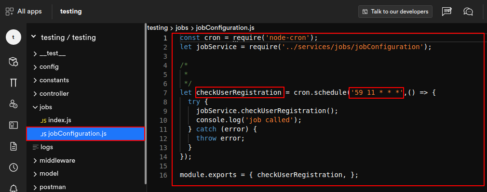

# Scheduler
Schedule functions to perform on your app in a specific period of time, in advance. Our scheduler feature offers multiple configurations. A few simple configurations can save hours of your precious time.

Create your custom scheduler for any particular function on the application.
>For example, you can create a notification to go off on specifically set intervals, for example, the snooze function on a mobile alarm clock. 

Scheduler gives you three configurations: 
- **Periodically**
- **Periodically with a time frame**
- **At a recurring fix time**
## Periodically
Configure a function to go off at a regular period of time or from time to time. Set if you want the operation to function in every minute/hour or on a certain minute/hour and select a particular day of the week or months of the year.
Once you have configured the period click on **generate cron expression** and it will be generated below. Then, click on create scheduler. 
>For example, in the image below the cron expression is */2***6-7

**"Every 2 minutes, Saturday through Sunday"**

 

## Periodically within a timeframe

Configure an operation to function within a set timeframe. Similar to periodically, enter **scheduler name** and **description**.
Now, set your preferred time, select **the starting** and **ending times**, and click on generate cron expression. And click on create scheduler. 
>For example, in the below image the cron expression is ***/6 9-18*****

**"Every 6 minutes, between 09:0m AM and 06:59 PM" **

 
## At a recurring fixed time
Configure the time to be fixed throughout the week or the month whatever duration you set. Similarly to "periodically within a timeframe" add all the details and then click on **generate cron expression** and click on **create scheduler.** 

>For example, in the below image the cron expression is **45 10 * * 1-5**

**"At 10:45 AM, Monday through Friday"**

 

## DhiWise generated code for scheduler

 

 

Got a question? [**Ask here**](https://discord.com/invite/rFMnCG5MZ7)

