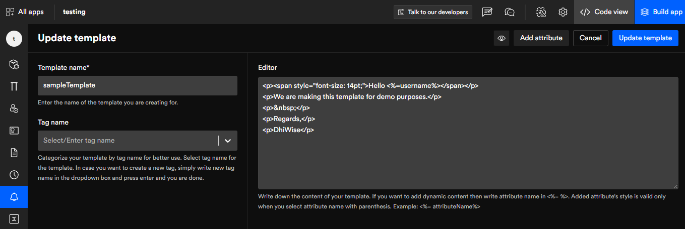

# SMS notification templates
Nowadays, we expect instant communications especially with SMS because a lot depends on it. Therefore, on DhiWise, we have created a way for this essential feature to be on your app hassle-free with just a few clicks.
## Add SMS template

 

**fill in the template name, tag name, description, and editor, then click on create template.**

- **Template name**: Enter the name of the template you are creating for. e.g offer deals or OTP codes. 

- **Tag name**: Categorize your different SMS templates by tag names to easily distinguish among them, for example, shipping order, account balance, etc.

- **Description**: Give your templates a brief description. It makes them easy to understand in the future. 

- **Editor**: Write down the content of your template. If you want to add dynamic content then write attribute name in <%= %>. Added attribute's style is valid only when you select attribute name with parenthesis. Example: <%= attributeName%> In the below image you can see the examples clearly.

Once you've filled in all the information you can preview it by click on the eye icon on the top right corner.

 

## Add attribute
Click on **add attribute** a side panel will appear where you can see the attributes you've input in the editor to which you can assign model attributes, for example, username, name, email, and password.

 

**After creating the template developers can tag, edit, or delete it.** 

#### Tag
You can search tags. It will help you to manage different types of templates. As you can see in the below image authentication is the tag. 
#### Edit
Once you have created a template you can always go back to it and do changes as per your requirements or if you've made any mistakes.
#### Delete
You can delete your templates with a single click if you wish. 

Also, you can always add more templates to your list. 

 

Got a question? [**Ask here**](https://discord.com/invite/rFMnCG5MZ7)

