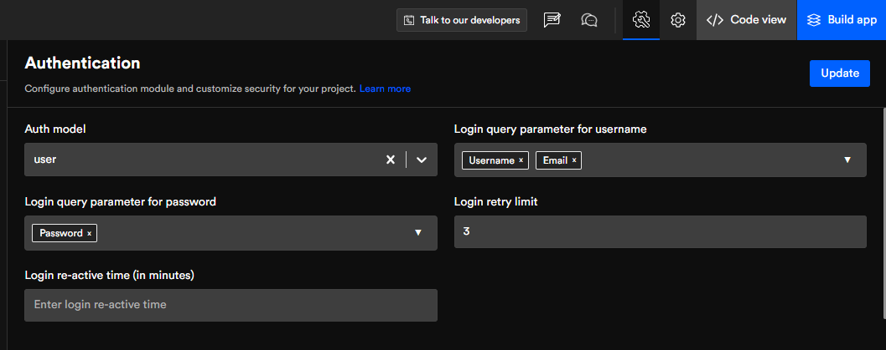
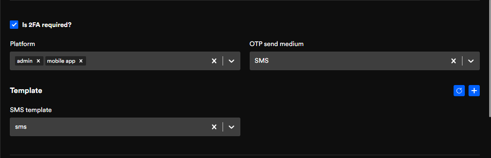
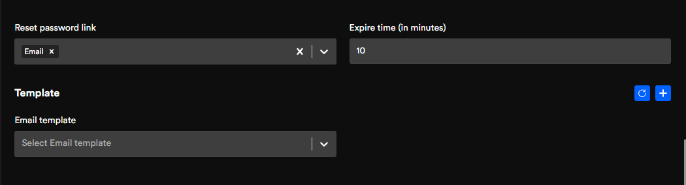
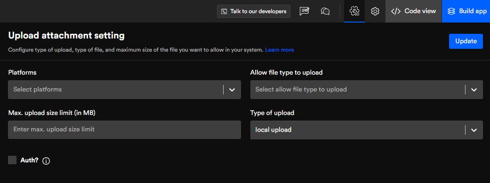

# Configuration backend apps

## Authentication & social authentication
Configure authentication and set security measures for your application.

Integrate social authentication (Facebook, Google, Linkedln, & GitHub) into your app for users to verify and access your application.

## Authentication
In authentication, you'll find the below mention fields.

### Auth model
A table that displays the information the user has to input.
### Query parameter for username
You can choose the parameters you wish to have, for your end-user to fill in, for example, Username, Password, Email, and Name.
### Query parameter for password
Similarly, choose the parameter for the password from the dropbox attributes.
### Login retry limit
If a user is unable to put correct credentials on their first try, you can limit the number of tries by entering the numerical you want until the login attempt gets restricted. 
### Login re-active time
Once the user has surpassed the login limit. They will be restricted for a set amount of time (In minutes) until they can try to login again.

### Is 2FA required?
Two Factor Authorization is two different ways of Identification one after the other. For example, once the end-user has logged in with their username and Password then the next authentication is a link or code sent on their Email ID or SMS for the final verification step.
### Template
You can choose among the templates you have already created for sms and email, or click on the right-hand corner (+) icon to add a new template and the icon next to it for a refresh.
### Reset password link
With this, you can choose which option the end-user will receive their reset password link on either via Email or SMS, or both. 
### Expire time (in minutes)
Choose the expiration time duration for the link after that limit the link will not work. 
### Template
Similar to the previous template option, you can choose the relevant template for the reset password link. 

### Restrict device
Limit the number of users who can access the device at once. e.g. Similar to that of Netflix, only a certain number of users can access Netflix at once.

### Upload attachment settings
Configure the type of upload, type of file, and maximum size of the file you want to allow in your system
Platform
Select any platform you wish. Here we have only selected the mobile app.
### Call back URL
A pop-up will appear where the end-user will fill in their login credentials for the social media site they've selected. Once they're successfully logged in. They will be transferred back to the site you have input in the callback URL.  
### Error URL
If the user is unsuccessful in login into their social media site. You can input the URL that takes them to the error page. 

We will be updating other configurations soon, stay tuned to get updated for the same.

Got a question? [**Ask here**](https://discord.com/invite/rFMnCG5MZ7)
<!--  -->