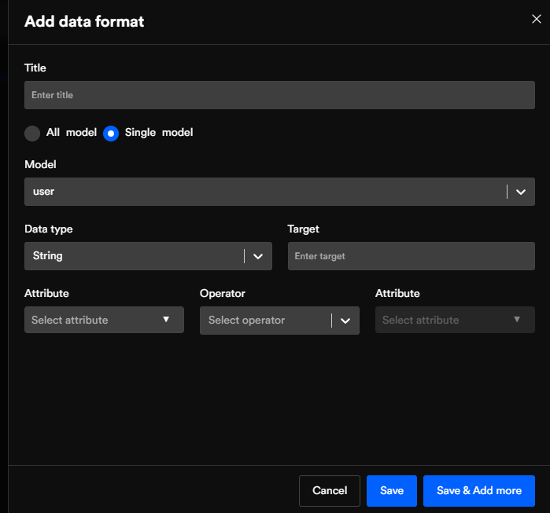
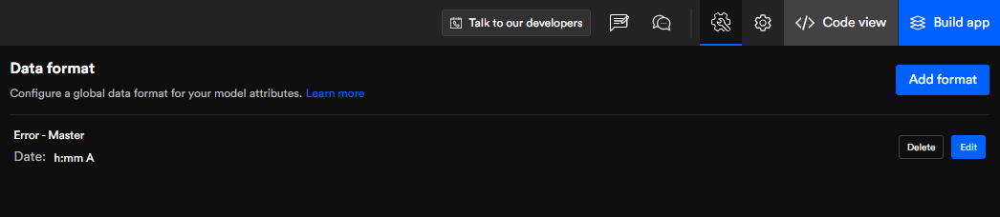

# Data format
We have created an interactive UI for you to easily configure your format data globally with many optimization options.

Data format feature helps developers set global data format for date, boolean, & string on the Node.js application.
<h2>To create your format input the below options:</h2>
<h3>Title</h3>
Enter a name
<h3>Data type</h3>
Select the data type option either Boolean or Date.
<h3>Date > Format</h3>
Select the date format of your choice from the below drop-down box.
<h3>Boolean > True and False</h3>
Add data format for a single model

.gif)

## Model
Select the "model" you wish to add. 
## Data type
You get the same data type with the exception of a new data type string.

In string, you have to enter "target",  select your model "attribute" then "operation" ("Space", '|',  ',') and model "attribute" again.

In the below image, we have created a data format for our model "user" and input the required values.

The below image shows how your data format looks when successfully added.

You also get the option to edit or delete your data format.

Got a question? [**Ask here**](https://discord.com/invite/rFMnCG5MZ7)