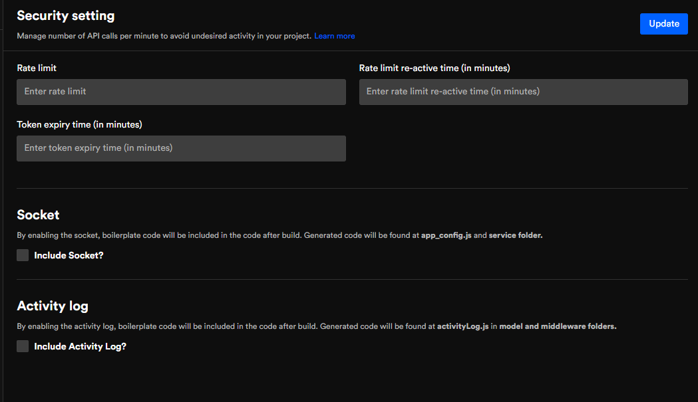

# Notification, security, & upload attachment
Configure notifications providers, security settings, and upload attachments settings in just a few clicks.

Notifications are alerts and reminders to your users about urgent or meaningful information. The end-user must get your message. Therefore, with DhiWise, we give you the support of the most popular service providers, so your users never miss a message from you, and all these with a few simple clicks.
## Notification provider. 
### SMS
Configure your SMS notification and simply add the required input. We are providing the code snippet for services such as Gupshup, AWS SNS, Twilio, Nexmo, and more will be added in future updates.  
### Email
Select your preferred service provider and add the required input. We are providing you code snippets for service providers such as AWS, Mailgun, and SendGrid. More will be added with future updates.  
### Push notification
Similar to SMS and Email, you can configure push notifications on your app with services such as Google, One signal, and AWS SNS. 


In configurations, the upload attachment setting is the last option.
## Upload attachment,
You can configure the file type and maximum size you want for your platform and user type to be allowed in the app. Under the upload file settings, you will see three fields: platform, allow file type to upload, and max. upload file limit. 
### Platform
Here you can choose the type of platform having access to upload files. Here, for now, we have only chosen the mobile app. 
### Max. upload size limit
Here you can choose the maximum file size to be upload on your app. Under it, you can also choose the option of single file upload or multiple file upload.
### Allow file type to upload
Below, are the upload file types you can pick to be on your app.
```
.bmp | .gif| .jpg | .jpeg| .pdf | .doc | .docx.xls | .xlsx | .csv |.zip | .vnd | .ms-excel.json | x-msdownload | x-ms-dos-program | x-ms-dos-executable
```
.png)

### Security Settings
Security settings manage the number of API calls per minute or within a given duration to avoid undesired activity in your project.
### Rate limit
This option helps you limit the number of times the API is used on the app, which helps secure your app. Once the number goes beyond your set limit the API will be restricted from the app. 
### Rate limit re-active time (in minutes)
Once the number of times the API is used goes over the limit it is restricted from any further use. Here you can set the duration of time (In minutes) for which the API is to be used again if it goes over the set limit. 
### Token expiry time (in minutes)
Once a session is activated on the app, the given time frame until it automatically logs out is called Token expiry time. You can set any timeframe (in minutes) you wish. 
### Socket
By enabling the socket, boilerplate code will be included in the code after the build. Generated code will be found at app_config.js and service folder.



Got a question? [**Ask here**](https://discord.com/invite/rFMnCG5MZ7)