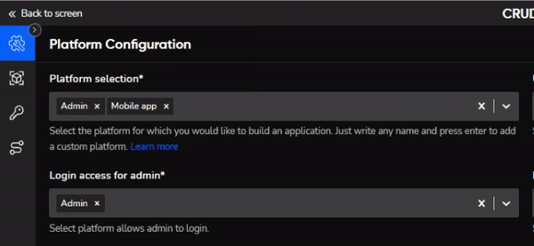
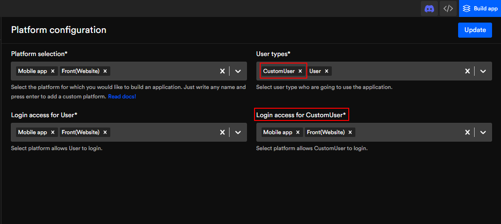
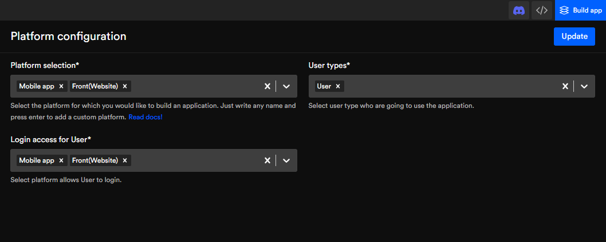
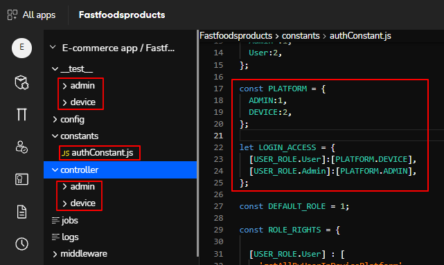

# Platform configuration
Select a platform and its application to manage your code structure and routes in an efficient manner.

Platform configuration generates CRUD APIs for different types of users to access respective platforms. For example, Admin should be able to configure every feature of an app while a user should only access a few specific features. 

We provide the default user type such as **Admin** and **User**, as well as default platform such as **Admin, Mobile App, Desktop, & Frontend(website)**.

## Select or custom create a platform



## Select or custom create user type
Create custom user types and give different types of users access to the required platforms



:::tip Example
An admin can have access to the admin and the desktop platform, while a user will have access to only a mobile app platform. 
:::
## The platform configuration interface


## Platform configuration code
```js title="constant>authConstant.js"
const PLATFORM = {
  ADMIN:1,
  DEVICE:2,
};

let LOGIN_ACCESS = {
  [USER_ROLE.User]:[PLATFORM.DEVICE],        
  [USER_ROLE.Admin]:[PLATFORM.ADMIN],        
};
```
## Platform configuration code.




Got a question? [**Ask here**](https://discord.com/invite/rFMnCG5MZ7)