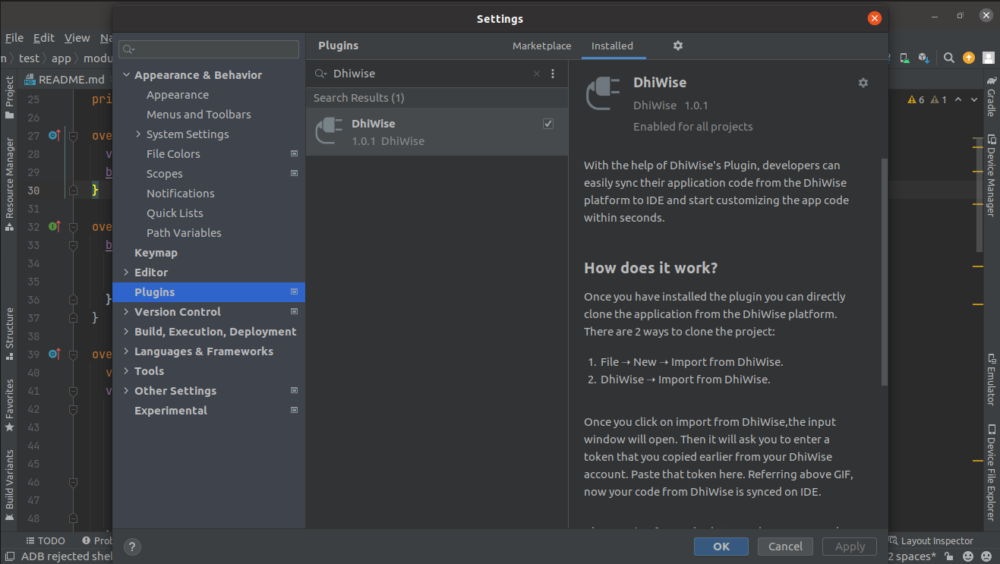
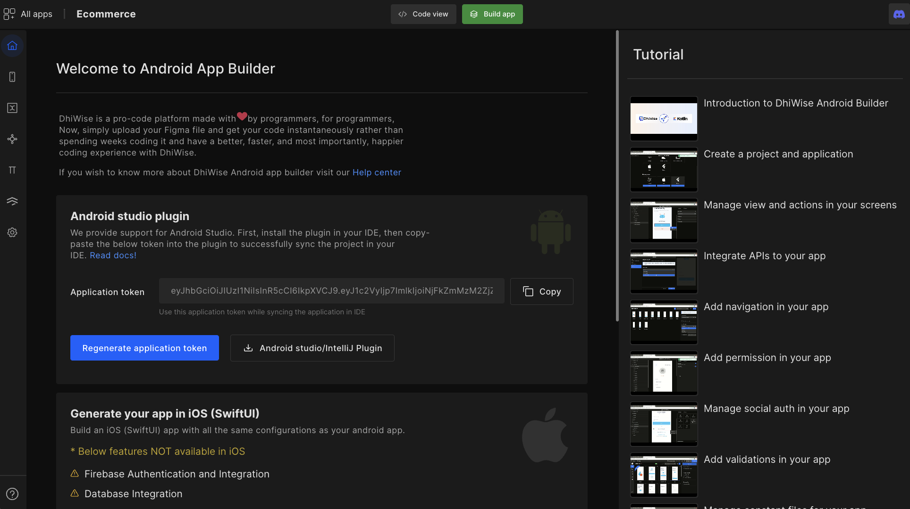
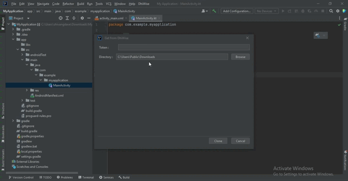
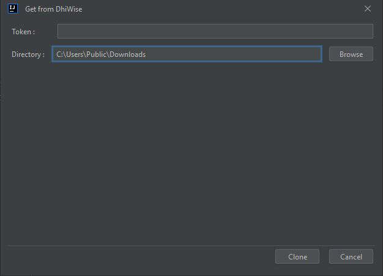

# Android Studio/ Intellij Plugin

The below guide will help you install the DhiWise plugin to your Android Studio & IntelliJ IDE. With the help of the Plugin, developers can easily sync their application code from the DhiWise platform to their IDE and start customizing the app code within seconds.

## Install the plugin to IDE

1. Select File ➝ Setting... ➝ Settings/Preferences ➝ Plugins

2. Find the DhiWise plugin in the Marketplace and click Install

:::note
Restart your IDE after installing the plugin.
:::

## Sync code to IDE

Once you have installed the plugin you can directly clone the application from the DhiWise platform. There are 2 ways to clone the project:

1. File ➝ New ➝ Import from DhiWise.

2. DhiWise ➝ Import from DhiWise.

    Once you click on import from DhiWise, the input window will open. 

3. Copy your application token from DhiWise dashboard and add it to the input window. 

    

4. Once you clicked on import from DhiWise, the input window will open paste the token into it.

    

    

Referring above GIF, now your code from DhiWise is synced on IDE.

Also, moving forward, whatever changes you make on your DhiWise application you can easily merge them with the code on IDE.

:::tip Example
Once you make any changes to your application on the DhiWise platform, click on Build app to implement those changes on your app, then simply go to IDE and press sync code. It will sync your code and show you all the conflict files, which you can merge similar to GitHub and GitLab.
:::

Now your code from DhiWise is synced on your IDE. Also, moving forward, any changes you make to your application you can easily merge them with the code on Android studio.

 
 

Got a question? [**Ask here**](https://discord.com/invite/rFMnCG5MZ7).