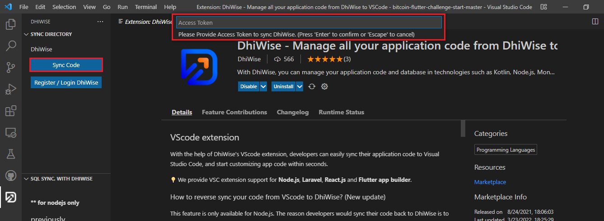

# VScode DhiWise plugin

## VScode extension

With the help of DhiWise's VScode extension, developers can easily sync their application code to Visual Studio Code and start customizing app code within seconds.

:::info
VScode extension supports Node.js, Laravel, Flutter, & Figma to React app builders!
:::

Check out the Android Studio/IntelliJ plugin. <a href="/docs/appresources/plugins-and-extensions/android-studio-and-intellij-plugin">Learn more</a>

How to update SQL (MySQL, PostgreSQL, SQL Server) database to DhiWise through VScode? (New update)

- Copy the VScode extension token from the platform and paste it into the access token field.

- Fill all the required SQL credentials

- That's it. Your SQL Database's Tables are added as Models in your Application 🥳

How to download the VScode extension from the DhiWise platform?

💡 The below steps are the same for all technologies.

Go to your **Node.js**, **Laravel**, **React**, or **Flutter** `application > go to settings > Vscode extension`.
In VScode extension, **download the extension** as well as **copy the application token** for VSC.

Go to `VSC > extension > Search` for DhiWise and click on `Install`

Click on the DhiWise logo, in the VSC side panel, to **sync** code. However, it will ask you to create a directory first for where you want to sync.

**Register/login DhiWise**: This button is a shortcut for you to directly login to your projects and application page on DhiWise without any need for verification.

To create a new directory, `go to Files > Open folder` (create a new folder or select a folder)

For example, we have already created a folder called **demo**.

Once you have set up a directory, click on Sync code again, then it will ask you to enter a token which you copied earlier from your DhiWise account. Paste that token here.

Kudos, now your code from DhiWise is synced on VSC.

Also, moving forward, whatever changes you make on your DhiWise application you can easily merge it with the code on VSC.

For example, once you make any changes to your application on the DhiWise platform, click on Build app to implement those changes on your app, then simply go to VSC and press sync. It will sync your code and show you all the conflict files, which you can merge similar to GitHub and GitLab.

In the below image on the left-hand side, you have the conflict files where the changes have been made. While on the right-hand side, you have a small control panel from where you can either merge the code or dismiss it.

To better understand the small control panel on the right, read the instructions given below.

**1 & 2**: The first two buttons will help you navigate the conflict quickly in the up and down direction where you can decide if you wish to merge or delete the code.

**3**: This button will help you merge the conflict code. It will update the new code to your VScode.

**4**: This button will delete the conflict. It will NOT update the new code.

**5**: This button will help you copy the code to the clipboard.

**6**: This button will save the results.

**7**: This button will show you all the shortcuts to the major actions on the keyboard.

**8**: This button will close the control panel.

The DhiWise plugin effectively and efficiently optimizes your time and provides you seamless user experience while you customize your code.

 
 

Got a question? [**Ask here**](https://discord.com/invite/rFMnCG5MZ7).