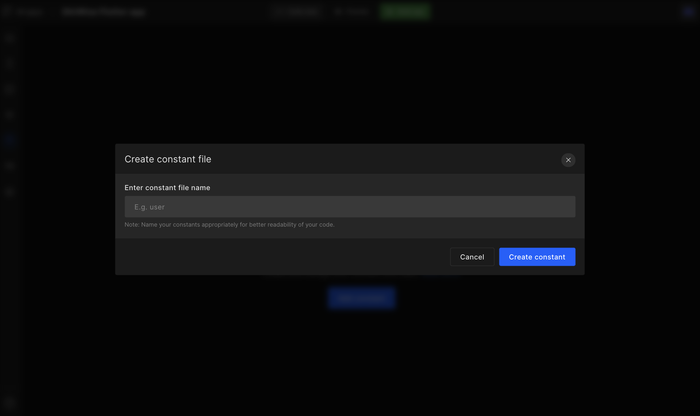
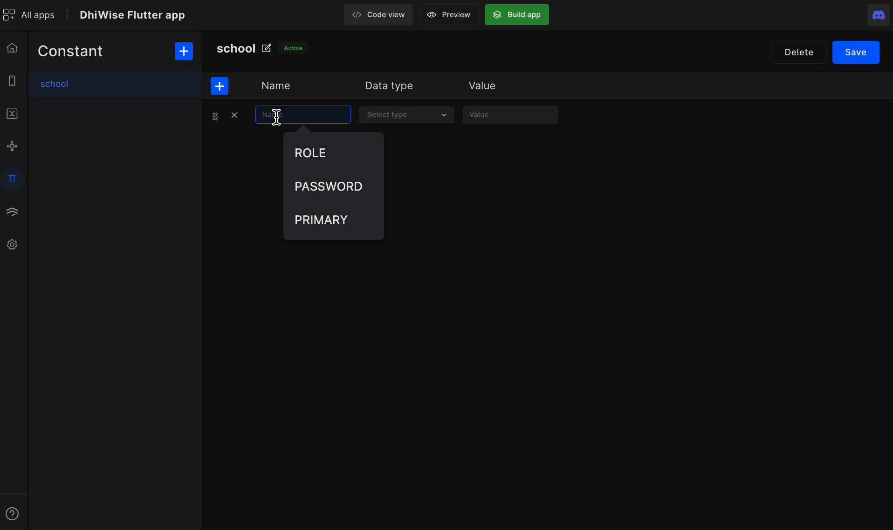

# Add App Constants

Constant files are used in app for easy access to the value which is to be used globally throughout the app. **Create**, **delete** constant files and add constants to it in your app and use it wherever you want to easily.

## How to setup constants

#### **Step 1:** 
Go to **Constant**(icon) from the screen dashboard on the left hand.
<!-- typeaddicon -->

#### **Step 2:** 
Now click on `Add constant` to add a new constant file to your application.

#### **Step 3:** 
Add an appropriate **file name** for your constant file and click `Create constant`.

#### **Step 4:** 
As your file is now created add your constants in it, for that, you need to add the following to create a constant.

<table className="table-key">
  <tbody>
    <tr>
      <td>Name</td>
      <td>Provide an appropriate name for constant,  only alphanumeric values with _ are allowed, and not starting with number</td>
    </tr>
    <tr>
      <td>Data type</td>
      <td>Select a data type based on the value of your constant, 

`INTEGER` | `STRING` | `FLOAT` | `DOUBLE` | `BOOLEAN`
</td>
    </tr>
    <tr>
      <td>Value</td>
      <td>Assign a value to added constant.</td>
    </tr>
  </tbody>
</table>

Similarly, you can add multiple constants to your file. Also, you can add multiple constant files by clicking on the ➕ icon as shown below;

#### **Step 5:** 
Once you have added the constants click on `Save`. To delete a constant click ❌ and to delete a constant file click `Delete`.

At this stage, you have successfully added constants to your application.

 
 

Got a question? [**Ask here**](https://discord.com/invite/rFMnCG5MZ7).