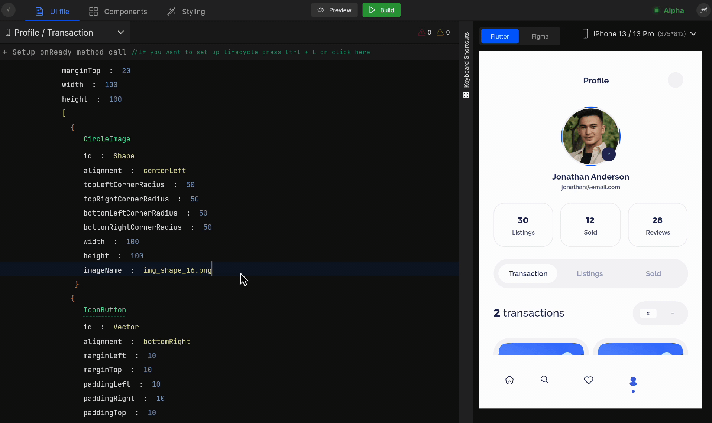

# Add Permissions

Permissions are set to get control of your phone and access to your **camera**, **photos**, **contact list**, **location**, and **phone storage**. App permission requests pop up the first time an app needs access to data on your phone and are related to user privacy.

## How to setup permission

#### **Step 1:** 
Select the screen from the screen list on which you want to add permission.

#### **Step 2:** 
Choose the widget and on the `onClick` property, select `Permission` from the actions suggestion box.
<!-- typewhiteonclick -->

#### **Step 3:** 
Then, select the permission type from the following:

| Type  | Description |
| --- | --- |
| **Camera + Gallery** | Allow access to use camera and photos |
| **Storage** | Allow access to use phone storage |
| **Location** | Allow access to use real-time location |
| **Contact list** | Allow access to use the contact list |

At this stage, you have successfully added permissions to your application.
 
 

Got a question? [**Ask here**](https://discord.com/invite/rFMnCG5MZ7).