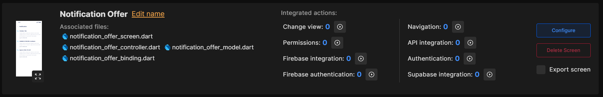
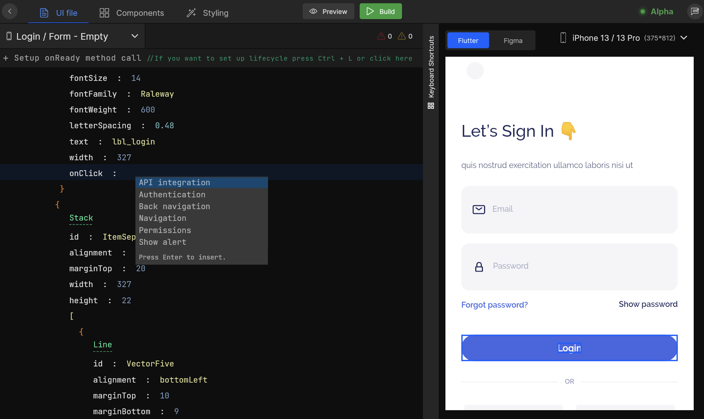
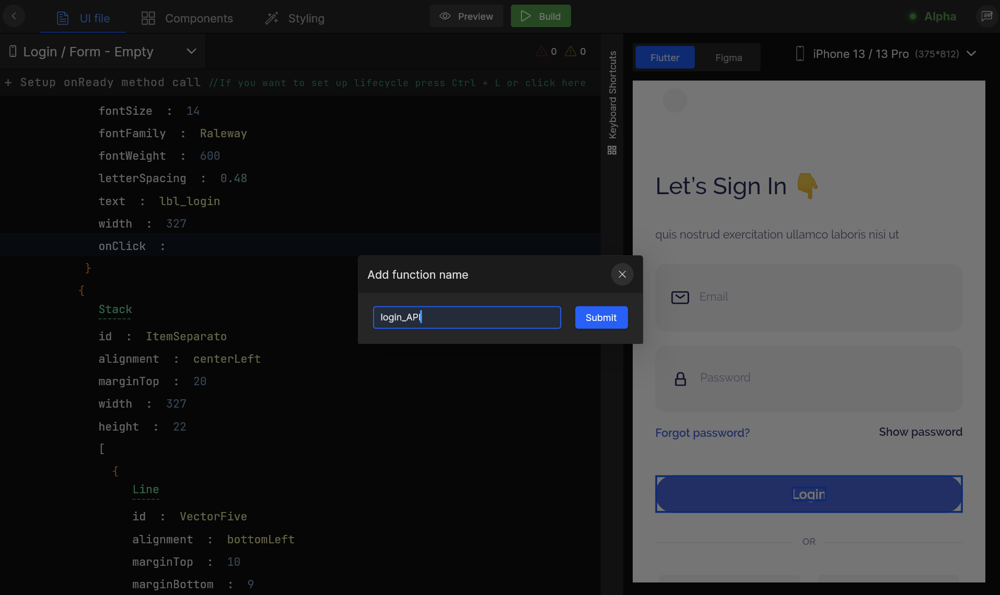
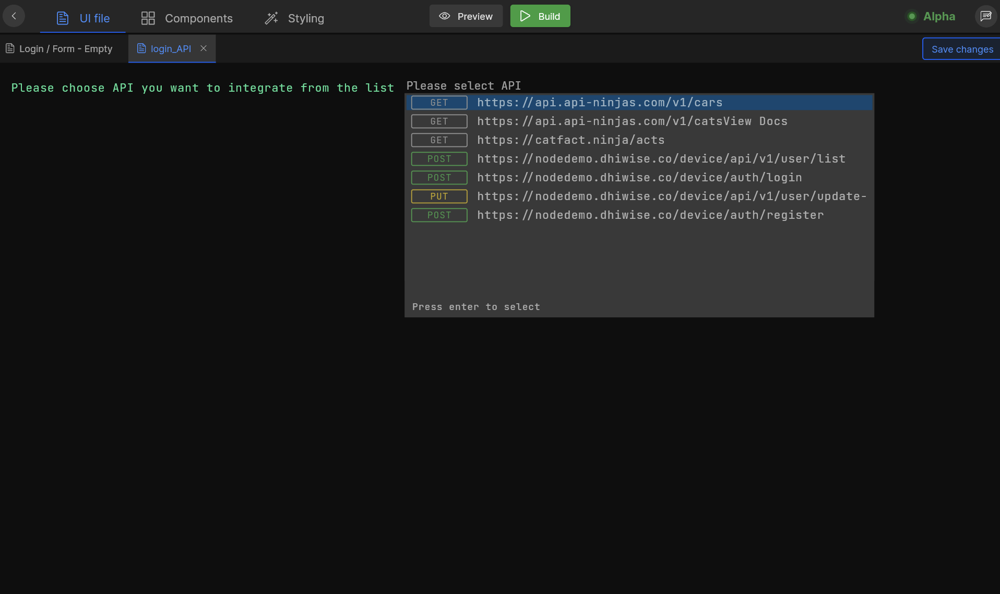
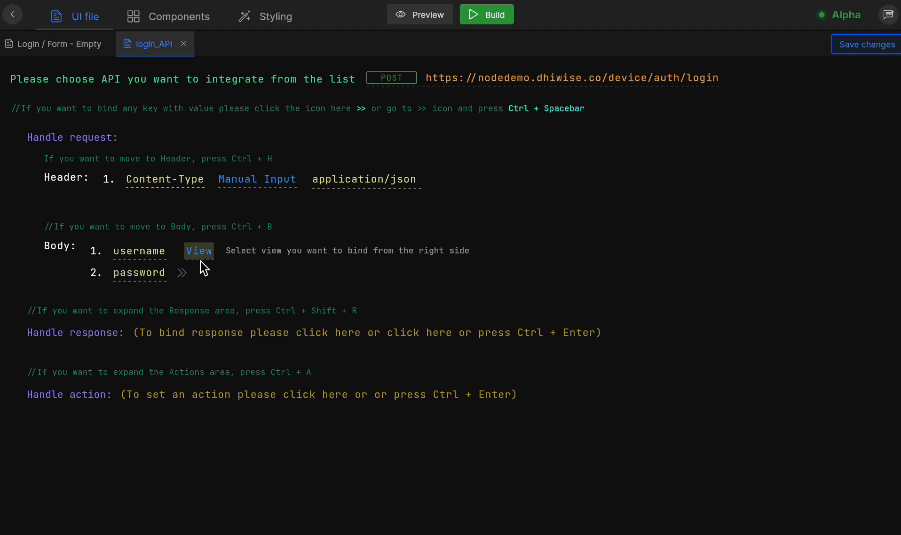
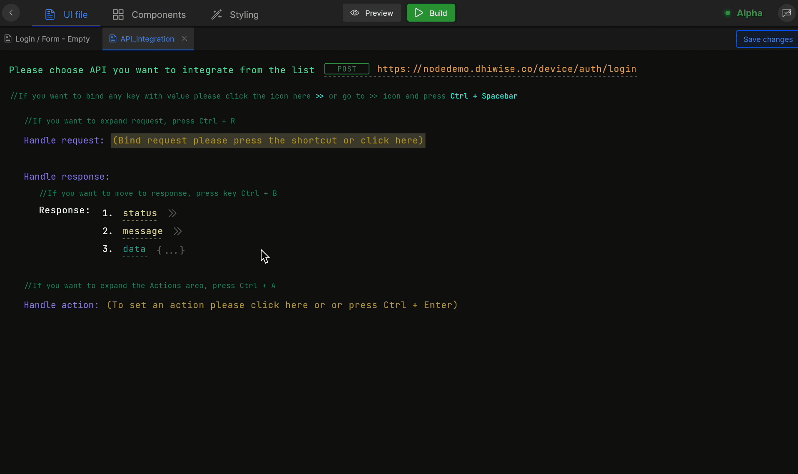

import navigationImg from "./img/navigation.png"
import ApiIntegrationImg from "./img/APIIntegration.png"
import AlertImg from "./img/Alert.png"

# API Integration

APIs play a vital role in making an application interactive. An application has to integrate a number of different APIs into it for its different functionalities to work. With DhiWise, setup these APIs easily for your application.

## **Add APIs**
To integrate APIs you require an API for your application in DhiWise, to use the same and set it up. Add <a href="/docs/flutter/add-apis-and-enviroment-variables#2-create-apis-manually">APIs manually</a> or import your <a href="/docs/flutter/add-apis-and-enviroment-variables#1-upload-postman-file">Postman collection</a> in DhiWise. 

:::tip Refer
<a href="/docs/flutter/add-apis-and-enviroment-variables" className="hightlight">Add APIs and Environment variables</a>
:::

## **Setup APIs**
Integrate API on any **screen**, **widget** or **view component** easily using the following steps:

:::tip
You can also integrate APIs in **lifecycle** method. <a href="/docs/flutter/manage-app-lifecycle" className="hightlight">Learn more.</a>
:::
### Select Screen
In your DhiWise application, select the screen from the screen list or choose `Configure` option for a particular screen, in which you want to set up an API.

### Select widget
<!-- lifecycle case -->
Now, as you open the screen in detail view, switch to the widget on which you want to integrate an API, add `onClick` property for setting up action and choose `API integration` from the actions list, as shown below;
<!-- typewhiteonclick -->

### Set function name
As you choose `API integration` action, firstly it will ask you to submit a proper **function name** for your API integration which will be generated for your screen code.

### Select your API 
Select an API that you want to bind with the selected view widget or lifecycle method, from the list of APIs added in DhiWise.

Now as you select the API, three following required steps are needed to be set up to complete your API integration. 

## **Step 1: Handle Request**

### Header and Params

Set your API’s `Header`, `Parameters`, and `Body` by switching to Handle request area. Headers and Parameter values will be the same as you have added to it while you add your API, in case you want to edit them you can change or add them here.

### Body

Switch to `Body` property and bind your request key with any of the below supported types to send data to your API request.

| Type | Description |
| --- | --- |
| **View** | Screen's widget or view component |
| **Constant** | Application app constant <a href="/docs/flutter/add-app-constants">Learn more</a>|
| **API response** | Priorly saved API response |
| **Get from preference** | Stored value from preferences |
| **Navigation argument** | Saved argument while navigation <a href="/docs/flutter/navigation#navigation-with-arguments">Learn more</a>|   

## **Step 2: Handle Response**

Save response data to **preferences** or bind them with **view** to display the response values in your application, in the **Handle response** area.

### Save to Preferences 

While handling your response data, save them to preferences by selecting the response key and giving it the desired name.

## **Step 3: Handle Actions**

Handle and choose what to perform on the **success** and **failure** methods after the API call in **Handle action** area;

### On success and On error actions
:::info
We are considering response code as `200` for success of API call rest code will be in error state.
:::

Select an action you want to execute on these methods from the actions list and set it up accordingly with the required inputs. **Actions supported on these methods are :**

      <a className="Card" href="/docs/flutter/api-integration">
        
        <h4>API integration</h4>
      </a>
      <a className="Card" href="/docs/flutter/navigation">
        
        <h4>Navigation</h4>
      </a>
      <a className="Card" href="/docs/flutter/show-alert">
        
        <h4>Show Alert dialog, Toast, Snackbar</h4>
      </a>
    

 

Click on `Submit` and your API is integrated.

 
 

Got a question? [**Ask here**](https://discord.com/invite/rFMnCG5MZ7).
