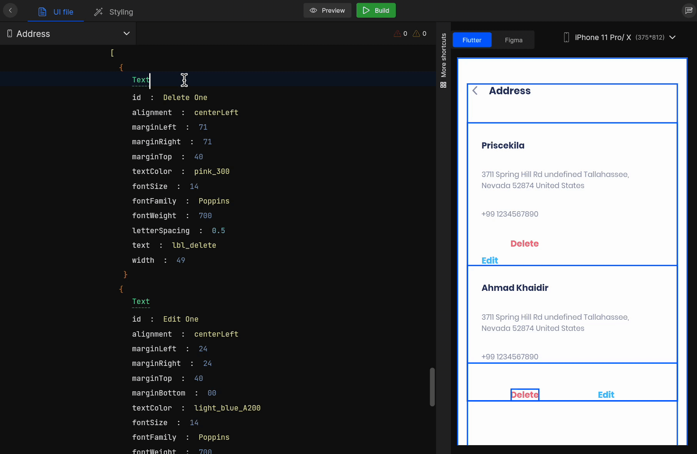

# Change Widget

After fetching Figma, the algorithm identifies the components in your design and generates UI on the basis of it for your app. However, not all UI components may be appropriately identified. Therefore, use the change widget functionality to modify the widget to its appropriate type.

:::info
Check out other supported change view from here<a href ="/docs/Designguidelines/component-specific-guidelines/change-view-components">Learn more</a>
:::

## How to change widget

#### **Step 1:** 
In the screen design, go to the widget you wish to modify.

#### **Step 2:** 
Just erase the widget name and press `Ctrl+Space` for a widget suggestion and select the appropriate widget you wish to modify.




Based on the modified widget, related widget properties are also added together so you can change the properties or their value easily.

<br/>

:::tip Example
For example, a **button** might be identified as an **image**; so, it can be easily changed to the **button** component.
:::

#### Generated code snippet


```js
class LoginScreen extends GetWidget<LoginController> {
  @override
  Widget build(BuildContext context) {
    return SafeArea(
        child: Scaffold(
            backgroundColor: ColorConstant.whiteA700,
            body: Container(
                width: size.width,
                child: SingleChildScrollView(
                    child: Container(
                      CustomButton(
                          width: 343,
                          text: "lbl_sign_in".tr,
                          margin: getMargin(left: 16, top: 16, right: 16),
                          onTap: onTapSignin2),
                    )))));
  }
}
```

<br/>
<br/>

Got a question? [**Ask here**](https://discord.com/invite/rFMnCG5MZ7).

