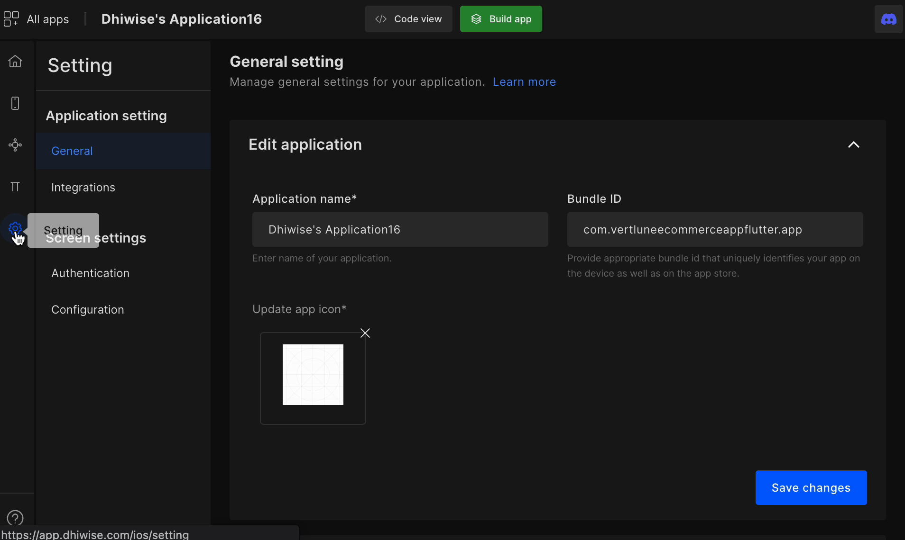
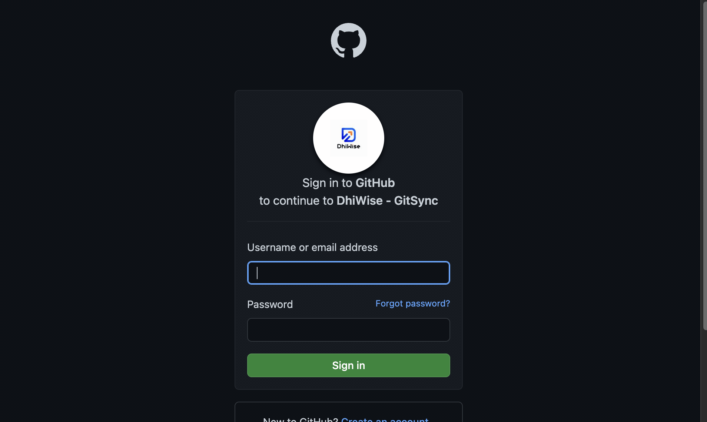
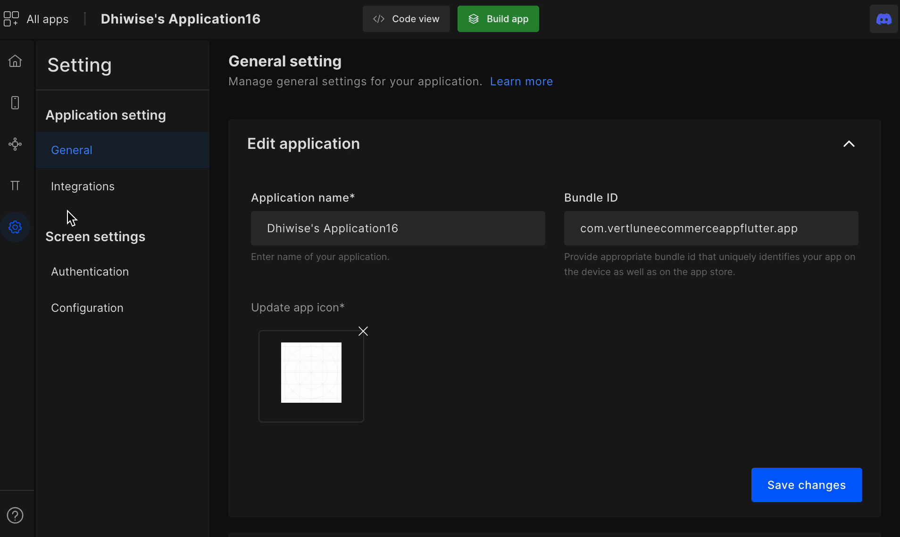
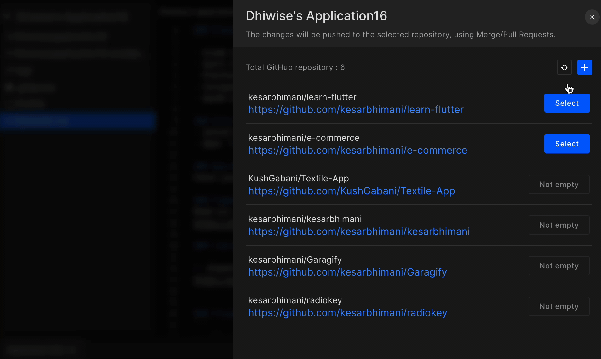

# Deploy or Download code

After you <a href="/docs/flutter/build-or-preview-app#build-app">build</a> your entire application, you will be redirected to the **code view** screen, where you will find your complete app code. Or click on `Code view` on the top to visit the same page.

We recommend you to check the **README.md** file, this file consists of the following information:

- App Details
- SDK Versions
- Dependent libraries
- Project structure
- Font assets

## **Download**

Download the app code to your system, and get your hands on it easily.

:::info
Simply click on **Download source code**(icon) button at the bottom-right of the page to download the code.
:::
<!-- typeaddicon -->
## **Sync application code to GitHub**

Sync and manage your application code with GitHub after you <a href="/docs/flutter/build-or-preview-app#build-app">Build app</a>.

#### **Step 1:** 
Go to applications settings and click on `Integrations` from the left panel. And select **GitHub** option.

#### **Step 2:** 
You will be taken to the GitHub login screen, where you are asked to provide your GitHub **username/email** and **password**, or create a <a href="https://docs.github.com/en/get-started/signing-up-for-github/signing-up-for-a-new-github-account" target="_blank">new GitHub account</a> if you do not already have one.

#### **Step 3:** 
After entering your credentials, you will be redirected to the **authorization** page. Click on `Authorize DhiWisePvtLtd` button to authorize DhiWise to sync code in your GitHub account.
<!-- typegreen -->

#### **Step 4:** 
When the authorization is completed, you will be taken to the DhiWise application settings page. Select integration and you will be able to see `Select repository` option. Please `select blank repository`; you will not be able to select a repository that already contains programming files. Also, a repository cannot be changed once is it committed.
<!-- typegreen -->

#### **Step 5:** 
By clicking on `Select repository` button, you can either select an existing one or click on ➕ button to add a new repository. It will redirect you to GitHub, and you can `create new repository`. After creating a new repository, click on `Refresh` button and you can see the newly created repository in the list.

#### **Step 6:**
After you select repository, you will see the GitHub repository name and URL. You can also switch repositories by clicking the <code className="primary">Change repository</code> button.

#### **Step 7:**
To commit code to GitHub, first <a href="/docs/flutter/build-or-preview-app#build-app">Build app</a> and then select `Code view`. The GitHub repository will be visible at the bottom of the code page. To push your application code to the GitHub repository, click `Commit`. You can also change the repository from here if necessary.  

## **Sync application code to GitLab**

Sync and manage your application code with GitLab after you <a href="/docs/flutter/build-or-preview-app#build-app">Build app</a>.

#### **Step 1:**
Go to applications settings and click on Integrations from the left panel. And select **GitLab** option.

#### **Step 2:**
When you click on the sync with GitLab button, a dialogue will appear with two options: **SaaS** and **Self manage**. To move to the next step, select any of the options and provide the necessary information.

:::info
To sync application code on GitLab, you need a Personal access token, <a href="https://docs.gitlab.com/ee/user/profile/personal_access_tokens.html" target="_blank">click here</a> to know how to generate personal access token on GitLab.
:::

### Sync GitLab Using SaaS
Choose **SaaS**, enter your **Personal access token**, and click `Submit`. The token will be verified when you provide the details, and you will be able to see the GitLab repository details.

### Sync GitLab Using Self manage   
Select `Self manage` and enter **Domain URL**, **Username**, and **Personal access token** and click on `Submit`. After providing the information, the token will be validated and you will be able to view the GitLab repository details. The **personal access token** has to be of the administrator.

#### **Step 1:**
When the authorization is complete, you will be returned to the DhiWise application settings page. Select integration and you will be able to see the **Select repository** option. Please select a **blank repository**; you will not be able to select a repository that already contains programming files.

#### **Step 2:**
By clicking on `Select repository` button, you can either select an existing one or click on ➕ button to add a new repository. It will redirect you to GitLab, and you can `create new repository`. After creating a new repository, click on `Refresh` button and you can see the newly created repository in the list.

#### **Step 3:**
After you select repository, you will see the GitLab repository name and URL. You can also switch repositories by clicking the <code className="primary">Change repository</code> button.

#### **Step 4:**
To commit code to GitLab, first `build app` and then select `Code view`. The GitLab repository will be visible at the bottom of the code page. To push your application code to the GitLab repository, click `Commit`. You can also change the repository from here if necessary. 

By following the above steps, you will be able to sync the app code with **GitHub** or **GitLab**.

 
 

Got a question? [**Ask here**](https://discord.com/invite/rFMnCG5MZ7).