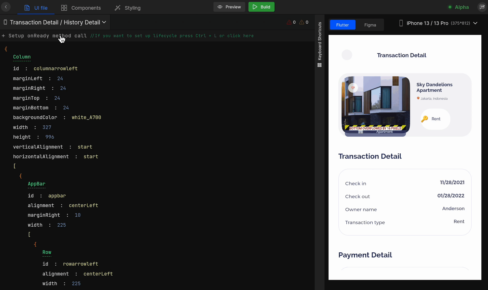
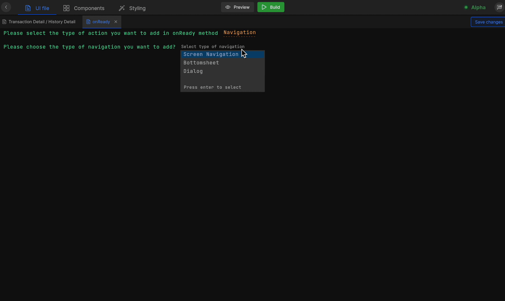

# Manage App Lifecycle

The lifecycle of the Flutter app is how the application will change its **state**.

## How to setup app lifecycle

#### **Step 1:** 
Select the screen from the screen list on which you want to set up the lifecycle.

#### **Step 2:** 
Click on **Setup onReady method call** available in the top left corner below the screen selection dropdown or simply press `Ctrl + L` to set up lifecycle for a screen.

**Step 3:** Next, select the action to be performed in the `on Ready` state. 

Below is the list of supported actions:

1. <e className="hightlight">API integration</e>
  
    Integrate APIs to your app lifecycle, simply select `API Integration`, and select the API from the list of APIs, that you want to call on invoking the method. Also, you can **add new API** to your application in DhiWise. <a href="/docs/flutter/api-integration">Learn more</a>.

    
    
2. <e className="hightlight">Navigation</e>
    
    Set navigation on lifecycle method by selecting Navigation from the list. <a href="/docs/flutter/navigation">Learn more</a>.

    
    
3. <e className="hightlight">Show alert</e>
    
    You can set up an **Alert dialog**, **Snackbar,** or **Toast** on the application’s lifecycle method <a href="/docs/flutter/show-alert">Learn more</a>.
    
4. <e className="hightlight">Permissions</e>
    
    Add Permissions to your app lifecycle, this will ask for Permission on the `on Ready` state of an application. You can set **Camera + Gallery**, **Store Permission**, **Location**, and **Contact list** types of permission. <a href="/docs/flutter/add-permissions">Learn more</a>.
    
5. <e className="hightlight">Supabase integration</e>
    
    Populate your screen with data on the `on Ready` state by integrating Supabase on the `on Ready` lifecycle method. <a href="/docs/flutter/supabase-integration">Learn more</a>.
    
6. <e className="hightlight">Firebase integration</e>
    
    Retrieve and display data on the screen setting up Firebase integration in your life cycle method. <a href="/docs/flutter/firebase-integration">Learn more</a>.

#### **Step 4:** 
Select the appropriate action and click on `Save changes`.

 
 

Got a question? [**Ask here**](https://discord.com/invite/rFMnCG5MZ7).